# 基于Docker容器运行时实现K8S 1.28二进制高可用集群

# 一、K8S集群架构说明

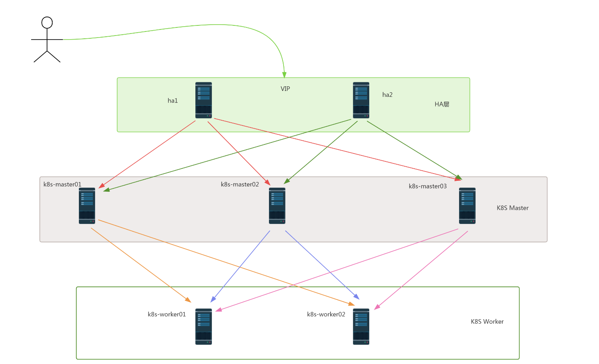


# 二、K8S集群主机配置

## 2.1  主机操作系统说明

| 序号 | 操作系统及版本 | 备注 |
| :--: | :------------: | :--: |
|  1   |   CentOS7u9    |      |


## 2.2  主机软、硬件配置说明

| 需求 | CPU  | 内存 | 硬盘   | 角色         | 主机名       | 软件                                                         |
| ---- | ---- | ---- | ------ | ------------ | ------------ | ------------------------------------------------------------ |
| 值   | 8C   | 8G   | 1024GB | HA           | ha1          | haproxy、keepalived                                          |
| 值   | 8C   | 8G   | 1024GB | HA           | ha2          | haproxy、keepalived                                          |
| 值   | 8C   | 8G   | 1024GB | master       | k8s-master01 | kube-apiserver、kubectl、kube-controller-manager、kube-scheduler |
| 值   | 8C   | 8G   | 1024GB | master       | k8s-master02 | kube-apiserver、kubectl、kube-controller-manager、kube-scheduler |
| 值   | 8C   | 8G   | 1024GB | master       | k8s-master03 | kube-apiserver、kubectl、kube-controller-manager、kube-scheduler |
| 值   | 8C   | 8G   | 1024GB | worker(node) | k8s-worker01 | kubelet、kube-proxy、Docker-ce、cri-dockerd                  |
| 值   | 8C   | 8G   | 1024GB | worker(node) | k8s-worker02 | kubelet、kube-proxy、Docker-ce、cri-dockerd                  |


## 2.3 主机IP地址分配


| 序号 | 主机名       | IP 地址           |
| ---- | ------------ | ----------------- |
| 1    | ha1          | 192.168.10.140/24 |
| 2    | ha2          | 192.168.10.141/24 |
| 3    | k8s-master01 | 192.168.10.142/24 |
| 4    | k8s-master02 | 192.168.10.143/24 |
| 5    | k8s-master03 | 192.168.10.144/24 |
| 6    | k8s-worker01 | 192.168.10.145/24 |
| 7    | k8s-worker02 | 192.168.10.146/24 |
| 8    | lb           | 192.168.10.100/24 |


# 三、K8S集群主机准备

## 3.1 主机名配置

> 所有主机均要配置

~~~powershell
# hostnamectl set-hostname XXX
# hostnamectl set-hostname k8sha1
# hostnamectl set-hostname k8sha2
~~~


## 3.2 IP地址配置

> 所有主机均要配置

~~~powershell
# vim /etc/sysconfig/network-scripts/ifcfg-ens33
# cat /etc/sysconfig/network-scripts/ifcfg-ens33
......
BOOTPROTO="none"
.......
IPADDR="192.168.10.14X"		# 静态 IP 地址
PREFIX="24"					# 24 位掩码
GATEWAY="192.168.10.2"		# 网关
DNS1="119.29.29.29"			# DNS
DNS2="8.8.8.8"
~~~


## 3.3 主机名与IP地址解析配置

> 所有主机都要配置

~~~powershell
# vim /etc/hosts
# cat /etc/hosts
127.0.0.1   localhost localhost.localdomain localhost4 localhost4.localdomain4
::1         localhost localhost.localdomain localhost6 localhost6.localdomain6
192.168.10.140 ha1
192.168.10.141 ha2
192.168.10.142 k8s-master01
192.168.10.143 k8s-master02
192.168.10.144 k8s-master03
192.168.10.145 k8s-worker01
192.168.10.146 k8s-worker02
~~~


## 3.4 主机安全配置

> 所有主机均要配置

### 3.4.1 主机防火墙设置


~~~powershell
# systemctl stop firewalld
# systemctl disable firewalld
~~~

~~~powershell
# systemctl disable --now firewalld
~~~

~~~powershell
# firewall-cmd --state
~~~


### 3.4.2 主机SELINUX设置

> 修改完SELINUX配置后，一定要重启主机配置。

~~~powershell
# setenforce 0
~~~

~~~powershell
# sed -ri 's/SELINUX=enforcing/SELINUX=disabled/' /etc/selinux/config
~~~

~~~powershell
# sestatus
~~~


## 3.5 主机系统时间同步配置

> 所有主机均要配置

~~~powershell
# yum -y install ntpdate
~~~

~~~powershell
# crontab -e		# crontab -l

0 */1 * * * ntpdate time1.aliyun.com		# 每隔1小时同步一次
~~~

~~~powershell
# rpm -qa|grep ntpdate
# ntpdate time1.aliyun.com
~~~


## 3.6 主机ipvs管理工具安装及模块加载

> 为K8S集群节点进行安装，其它节点不安装。

~~~powershell
# yum -y install ipvsadm ipset sysstat conntrack libseccomp
~~~

~~~powershell
配置ipvsadm模块加载方式
添加需要加载的模块
# cat > /etc/sysconfig/modules/ipvs.modules <<EOF
#!/bin/bash
modprobe -- ip_vs
modprobe -- ip_vs_rr
modprobe -- ip_vs_wrr
modprobe -- ip_vs_sh
modprobe -- nf_conntrack
EOF
~~~

~~~powershell
授权、运行、检查是否加载
# chmod 755 /etc/sysconfig/modules/ipvs.modules && bash /etc/sysconfig/modules/ipvs.modules && lsmod | grep -e ip_vs -e nf_conntrack
~~~


## 3.7 Linux内核升级

> 所有主机均可升级。

~~~powershell
导入elrepo gpg key
# rpm --import https://www.elrepo.org/RPM-GPG-KEY-elrepo.org
~~~

~~~powershell
安装elrepo YUM源仓库
# yum -y install https://www.elrepo.org/elrepo-release-7.0-4.el7.elrepo.noarch.rpm
~~~

~~~powershell
安装kernel-lt版本，ml为最新稳定版本，lt为长期维护版本
# yum --enablerepo="elrepo-kernel" -y install kernel-lt.x86_64
~~~

~~~powershell
设置grub2默认引导为0
# grub2-set-default 0
~~~

~~~powershell
重新生成grub2引导文件
# grub2-mkconfig -o /boot/grub2/grub.cfg
~~~

~~~powershell
更新后，需要重启，使用升级的内核生效。
# reboot
~~~

~~~powershell
重启后，需要验证内核是否为更新对应的版本
# uname -r
~~~


## 3.8 开启主机内核路由转发及网桥过滤


>所有主机均需要操作，ha1、ha2 就不需要执行了。

>配置内核加载`br_netfilter`和`iptables`放行`ipv6`和`ipv4`的流量，确保集群内的容器能够正常通信。


~~~powershell
添加网桥过滤及内核转发配置文件
# cat > /etc/sysctl.d/k8s.conf << EOF
net.bridge.bridge-nf-call-ip6tables = 1
net.bridge.bridge-nf-call-iptables = 1
net.ipv4.ip_forward = 1
vm.swappiness = 0
EOF
~~~

~~~powershell
加载br_netfilter模块
# modprobe br_netfilter

# sysctl -p /etc/sysctl.d/k8s.conf
~~~

~~~powershell
查看是否加载
# lsmod | grep br_netfilter
br_netfilter           22256  0
bridge                151336  1 br_netfilter
~~~


## 3.9 关闭主机SWAP分区


> 修改完成后需要重启操作系统，如不重启，可临时关闭，命令为swapoff -a

~~~powershell
# swapoff -a	# 临时关闭，主机重新启动，还会存在。

永远关闭swap分区，需要重启操作系统
# cat /etc/fstab
......

# /dev/mapper/centos-swap swap                    swap    defaults        0 0

在上一行中行首添加#
~~~


## 3.10 K8S集群节点间免密登录配置

>在k8s-master01节点上创建即可 ，复制公钥到其它节点。

~~~powershell
[root@k8s-master01 ~]# ssh-keygen -t rsa
~~~

~~~powershell
[root@k8s-master01 ~]# ssh-copy-id root@k8s-master02
~~~

~~~powershell
[root@k8s-master01 ~]# ssh-copy-id root@k8s-master03
~~~

~~~powershell
[root@k8s-master01 ~]# ssh-copy-id root@k8s-worker01
~~~

~~~powershell
[root@k8s-master01 ~]# ssh-copy-id root@k8s-worker02
~~~


# 四、负载均衡器部署 Haproxy+Keepalived

## 4.1 Haproxy & Keepalived安装

> 在ha1及ha2节点上。

~~~powershell
# yum -y install haproxy keepalived
~~~


## 4.2 Haproxy配置文件准备

> 所有节点都相同，直接复制就可以了。


~~~powershell
# cat > /etc/haproxy/haproxy.cfg << "EOF"
global
 maxconn 2000
 ulimit-n 16384
 log 127.0.0.1 local0 err
 stats timeout 30s

defaults
 log global
 mode http
 option httplog
 timeout connect 5000
 timeout client 50000
 timeout server 50000
 timeout http-request 15s
 timeout http-keep-alive 15s

frontend monitor-in
 bind *:33305
 mode http
 option httplog
 monitor-uri /monitor

frontend k8s-master
 bind 0.0.0.0:6443
 bind 127.0.0.1:6443
 mode tcp
 option tcplog
 tcp-request inspect-delay 5s
 default_backend k8s-master

backend k8s-master
 mode tcp
 option tcplog
 option tcp-check
 balance roundrobin
 default-server inter 10s downinter 5s rise 2 fall 2 slowstart 60s maxconn 250 maxqueue 256 weight 100
 server  k8s-master01  192.168.59.170:6443 check
 server  k8s-master02  192.168.59.171:6443 check
 server  k8s-master03  192.168.59.172:6443 check
EOF
~~~


## 4.3 Keepalived配置文件及健康检查脚本准备

> 需要注意：Master节点与Backup节点配置有区别。

### 4.3.1 ha1节点

~~~powershell
# cat > /etc/keepalived/keepalived.conf << "EOF"
! Configuration File for keepalived
global_defs {
   router_id LVS_DEVEL
script_user root
   enable_script_security
}
vrrp_script chk_apiserver {
   script "/etc/keepalived/check_apiserver.sh"
   interval 5
   weight -5
   fall 2 
rise 1
}
vrrp_instance VI_1 {
   state MASTER
   interface ens33
   mcast_src_ip 192.168.59.168
   virtual_router_id 51
   priority 100
   advert_int 2
   authentication {
       auth_type PASS
       auth_pass K8SHA_KA_AUTH
   }
   virtual_ipaddress {
       192.168.59.100
   }
   track_script {
      chk_apiserver
   }
}
EOF
~~~


~~~powershell
# cat > /etc/keepalived/check_apiserver.sh <<"EOF"
#!/bin/bash
err=0
for k in $(seq 1 3)
do
   check_code=$(pgrep haproxy)
   if [[ $check_code == "" ]]; then
       err=$(expr $err + 1)
       sleep 1
       continue
   else
       err=0
       break
   fi
done

if [[ $err != "0" ]]; then
   echo "systemctl stop keepalived"
   /usr/bin/systemctl stop keepalived
   exit 1
else
   exit 0
fi
EOF
~~~

~~~powershell
# chmod +x /etc/keepalived/check_apiserver.sh
~~~


### 4.3.2 ha2节点


~~~powershell
# cat > /etc/keepalived/keepalived.conf << "EOF"
! Configuration File for keepalived
global_defs {
   router_id LVS_DEVEL
script_user root
   enable_script_security
}
vrrp_script chk_apiserver {
   script "/etc/keepalived/check_apiserver.sh"
  interval 5
   weight -5
   fall 2 
rise 1
}
vrrp_instance VI_1 {
   state BACKUP
   interface ens33
   mcast_src_ip 192.168.59.169
   virtual_router_id 51
   priority 99
   advert_int 2
   authentication {
       auth_type PASS
       auth_pass K8SHA_KA_AUTH
   }
   virtual_ipaddress {
       192.168.59.100
   }
   track_script {
      chk_apiserver
   }
}
EOF
~~~


~~~powershell
# cat > /etc/keepalived/check_apiserver.sh <<"EOF"
#!/bin/bash
err=0
for k in $(seq 1 3)
do
   check_code=$(pgrep haproxy)
   if [[ $check_code == "" ]]; then
       err=$(expr $err + 1)
       sleep 1
       continue
   else
       err=0
       break
   fi
done

if [[ $err != "0" ]]; then
   echo "systemctl stop keepalived"
   /usr/bin/systemctl stop keepalived
   exit 1
else
   exit 0
fi
EOF
~~~

~~~powershell
# chmod +x /etc/keepalived/check_apiserver.sh
~~~


## 4.4 Haproxy & Keepalived服务启动及验证


~~~powershell
[root@ha1 ~]# systemctl enable --now haproxy keepalived
~~~

~~~powershell
[root@ha2 ~]# systemctl status haproxy keepalived
~~~


~~~powershell
[root@ha1 ~]# ip a s
1: lo: <LOOPBACK,UP,LOWER_UP> mtu 65536 qdisc noqueue state UNKNOWN group default qlen 1000
    link/loopback 00:00:00:00:00:00 brd 00:00:00:00:00:00
    inet 127.0.0.1/8 scope host lo
       valid_lft forever preferred_lft forever
    inet6 ::1/128 scope host
       valid_lft forever preferred_lft forever
2: ens33: <BROADCAST,MULTICAST,UP,LOWER_UP> mtu 1500 qdisc pfifo_fast state UP group default qlen 1000
    link/ether 00:0c:29:aa:5c:b4 brd ff:ff:ff:ff:ff:ff
    inet 192.168.10.140/24 brd 192.168.10.255 scope global noprefixroute ens33
       valid_lft forever preferred_lft forever
    inet 192.168.10.100/32 scope global ens33
       valid_lft forever preferred_lft forever
    inet6 fe80::6305:76c5:ac2c:894e/64 scope link noprefixroute
       valid_lft forever preferred_lft forever
~~~


# 五、ETCD数据库部署

> 以下操作均在k8s-master01上执行即可。


## 5.1 创建工作目录

~~~powershell
[root@k8s-master01 ~]# mkdir -p /data/k8s-work
~~~


## 5.2 获取cfssl工具

>说明：
>cfssl是使用go编写，由CloudFlare开源的一款PKI/TLS工具。主要程序有：
>
>- cfssl是CFSSL的命令行工具
>
>- cfssljson用来从cfssl程序获取JSON输出，并将证书，密钥，CSR和bundle写入文件中


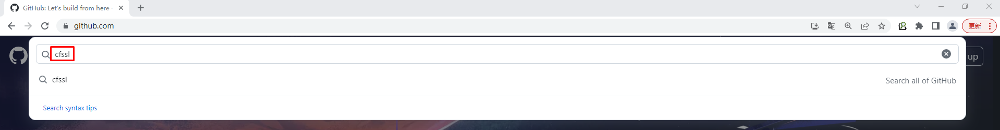


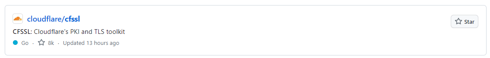

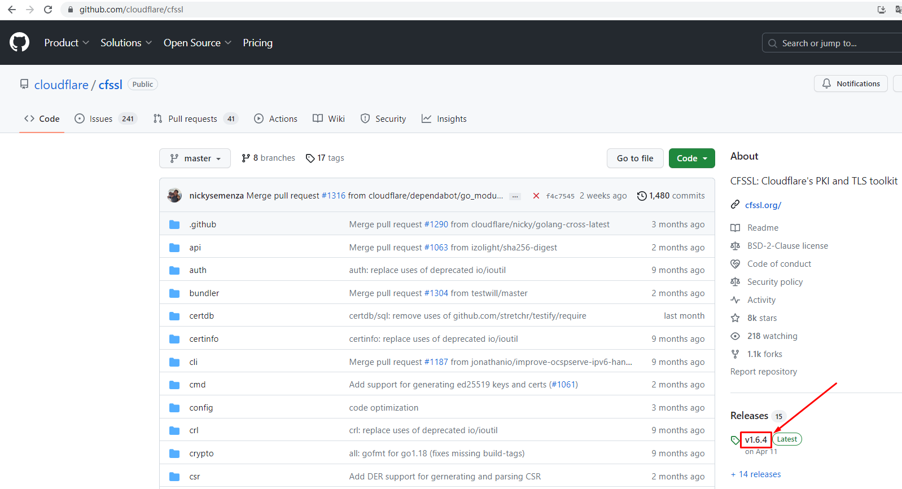


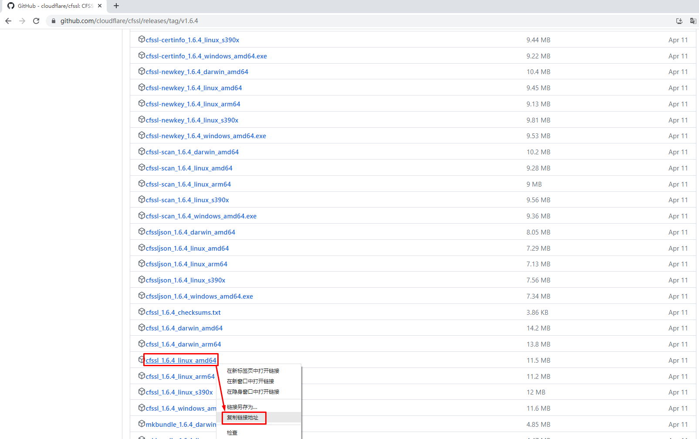


~~~powershell
[root@k8s-master01 k8s-work]# wget https://github.com/cloudflare/cfssl/releases/download/v1.6.4/cfssl_1.6.4_linux_amd64
~~~


~~~powershell
[root@k8s-master01 k8s-work]# ls
cfssl_1.6.4_linux_amd64
[root@k8s-master01 k8s-work]# chmod +x cfssl_1.6.4_linux_amd64
[root@k8s-master01 k8s-work]# ls
cfssl_1.6.4_linux_amd64
[root@k8s-master01 k8s-work]# mv cfssl_1.6.4_linux_amd64 /usr/local/bin/cfssl
~~~


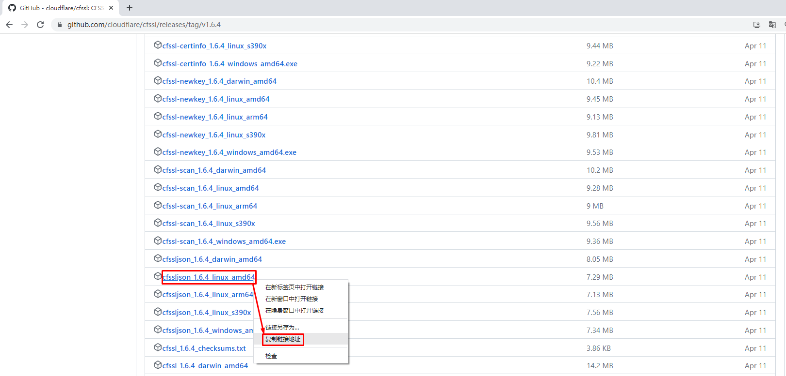


~~~powershell
[root@k8s-master01 k8s-work]# wget https://github.com/cloudflare/cfssl/releases/download/v1.6.4/cfssljson_1.6.4_linux_amd64
~~~

~~~powershell
[root@k8s-master01 k8s-work]# ls
cfssljson_1.6.4_linux_amd64
[root@k8s-master01 k8s-work]# chmod +x cfssljson_1.6.4_linux_amd64
[root@k8s-master01 k8s-work]# ls
cfssljson_1.6.4_linux_amd64
[root@k8s-master01 k8s-work]# mv cfssljson_1.6.4_linux_amd64 /usr/local/bin/cfssljson
~~~


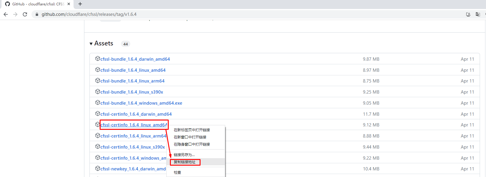


~~~powershell
[root@k8s-master01 k8s-work]# wget https://github.com/cloudflare/cfssl/releases/download/v1.6.4/cfssl-certinfo_1.6.4_linux_amd64
~~~

~~~powershell
[root@k8s-master01 k8s-work]# ls
cfssl-certinfo_1.6.4_linux_amd64
[root@k8s-master01 k8s-work]# chmod +x cfssl-certinfo_1.6.4_linux_amd64
[root@k8s-master01 k8s-work]# ls
cfssl-certinfo_1.6.4_linux_amd64
[root@k8s-master01 k8s-work]# mv cfssl-certinfo_1.6.4_linux_amd64 /usr/local/bin/cfssl-certinfo
~~~


## 5.3  创建CA证书


### 5.3.1 配置CA证书请求文件


~~~powershell
[root@k8s-master01 k8s-work]# cat > ca-csr.json <<"EOF"
{
  "CN": "kubernetes",
  "key": {
      "algo": "rsa",
      "size": 2048
  },
  "names": [
    {
      "C": "CN",
      "ST": "Shanghai",
      "L": "Shanghai",
      "O": "kubescm",
      "OU": "CN"
    }
  ],
  "ca": {
          "expiry": "87600h"
  }
}
EOF
~~~


~~~powershell
[root@k8s-master01 k8s-work]# cat ca-csr.json
{
  "CN": "kubernetes",
  "key": {
      "algo": "rsa",
      "size": 2048
  },
  "names": [
    {
      "C": "CN",
      "ST": "Shanghai",
      "L": "Shanghai",
      "O": "kubescm",
      "OU": "CN"
    }
  ],
  "ca": {
          "expiry": "87600h"
  }
}
~~~


### 5.3.2 创建CA证书


~~~powershell
[root@k8s-master01 k8s-work]# cfssl gencert -initca ca-csr.json | cfssljson -bare ca
~~~

~~~powershell
输出内容如下：
2023/08/23 16:09:52 [INFO] generating a new CA key and certificate from CSR
2023/08/23 16:09:52 [INFO] generate received request
2023/08/23 16:09:52 [INFO] received CSR
2023/08/23 16:09:52 [INFO] generating key: rsa-2048
2023/08/23 16:09:52 [INFO] encoded CSR
2023/08/23 16:09:52 [INFO] signed certificate with serial number 431686656459767407203474258329573467196543930870
~~~

~~~powershell
[root@k8s-master01 k8s-work]# ls
ca.csr  ca-csr.json  ca-key.pem  ca.pem
~~~


### 5.3.3 CA证书策略


~~~powershell
[root@k8s-master01 k8s-work]# cat > ca-config.json <<"EOF"
{
  "signing": {
      "default": {
          "expiry": "87600h"
        },
      "profiles": {
          "kubernetes": {
              "usages": [
                  "signing",
                  "key encipherment",
                  "server auth",
                  "client auth"
              ],
              "expiry": "87600h"
          }
      }
  }
}
EOF
~~~


~~~powershell
[root@k8s-master01 k8s-work]# ls
ca-config.json  ca.csr  ca-csr.json  ca-key.pem  ca.pem
~~~

~~~powershell
server auth 表示client可以对使用该ca对server提供的证书进行验证

client auth 表示server可以使用该ca对client提供的证书进行验证
~~~


## 5.4 创建etcd证书


### 5.4.1 配置etcd请求文件


~~~powershell
[root@k8s-master01 k8s-work]# cat > etcd-csr.json <<"EOF"
{
  "CN": "etcd",
  "hosts": [
    "127.0.0.1",
    "192.168.59.170",
    "192.168.59.171",
    "192.168.59.172"
  ],
  "key": {
    "algo": "rsa",
    "size": 2048
  },
  "names": [{
    "C": "CN",
    "ST": "Shanghai",
    "L": "Shanghai",
    "O": "kubescm",
    "OU": "CN"
  }]
}
EOF
~~~


~~~powershell
[root@k8s-master01 k8s-work]# ls
ca-config.json  ca.csr  ca-csr.json  ca-key.pem  ca.pem  etcd-csr.json
~~~


### 5.4.2 生成etcd证书


~~~powershell
[root@k8s-master01 k8s-work]# cfssl gencert -ca=ca.pem -ca-key=ca-key.pem -config=ca-config.json -profile=kubernetes etcd-csr.json | cfssljson  -bare etcd
~~~

~~~powershell
输出：
2023/08/23 16:31:01 [INFO] generate received request
2023/08/23 16:31:01 [INFO] received CSR
2023/08/23 16:31:01 [INFO] generating key: rsa-2048
2023/08/23 16:31:01 [INFO] encoded CSR
2023/08/23 16:31:01 [INFO] signed certificate with serial number 493558008356376630066109944778970086553418380903
~~~

~~~powershell
[root@k8s-master01 k8s-work]# ls
ca-config.json  ca.csr  ca-csr.json  ca-key.pem  ca.pem  etcd.csr  etcd-csr.json  etcd-key.pem  etcd.pem
~~~


## 5.5 etcd集群部署

### 5.5.1 下载etcd软件包

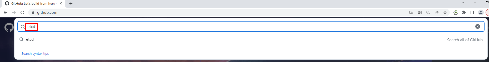


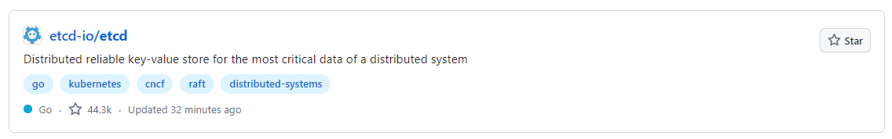


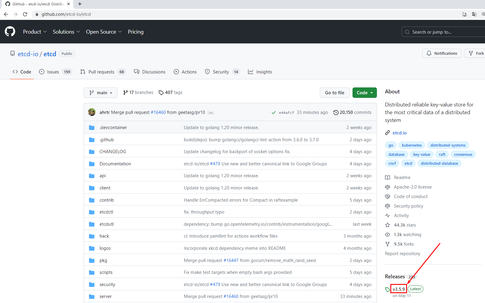


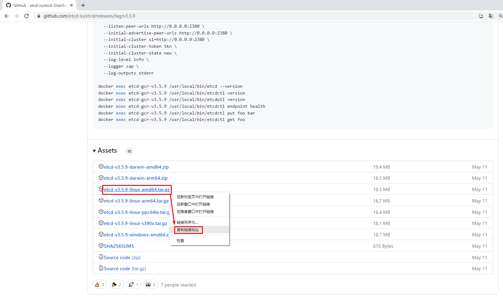


~~~powershell
[root@k8s-master01 k8s-work]# wget https://github.com/etcd-io/etcd/releases/download/v3.5.9/etcd-v3.5.9-linux-amd64.tar.gz
~~~

~~~powershell
[root@k8s-master01 k8s-work]# ls
etcd-v3.5.9-linux-amd64.tar.gz
~~~


### 5.5.2 etcd软件分发


~~~powershell
[root@k8s-master01 k8s-work]# tar xvf etcd-v3.5.9-linux-amd64.tar.gz
~~~

~~~powershell
[root@k8s-master01 k8s-work]# ls etcd-v3.5.9-linux-amd64
Documentation  etcd  etcdctl  etcdutl  README-etcdctl.md  README-etcdutl.md  README.md  READMEv2-etcdctl.md
[root@k8s-master01 k8s-work]# cp -p etcd-v3.5.9-linux-amd64/etcd* /usr/local/bin/
~~~

~~~powershell
[root@k8s-master01 k8s-work]# scp -p etcd-v3.5.9-linux-amd64/etcd* k8s-master02:/usr/local/bin/

# scp -p etcd* k8smaster2:/usr/local/bin/
~~~

~~~powershell
[root@k8s-master01 k8s-work]# scp -p etcd-v3.5.9-linux-amd64/etcd* k8s-master03:/usr/local/bin/

# scp -p etcd* k8smaster3:/usr/local/bin/
~~~


### 5.5.3 创建etcd配置文件


#### 5.5.3.1 创建etcd配置文件

> 所有master节点上都需要。

**k8s-master01**

~~~powershell
[root@k8s-master01 ~]# mkdir /etc/etcd
~~~

~~~powershell
[root@k8s-master01 ~]# cat >  /etc/etcd/etcd.conf << "EOF"
#[Member]
ETCD_NAME="etcd1"
ETCD_DATA_DIR="/var/lib/etcd/default.etcd"
ETCD_LISTEN_PEER_URLS="https://192.168.59.170:2380"
ETCD_LISTEN_CLIENT_URLS="https://192.168.59.170:2379,http://127.0.0.1:2379"

#[Clustering]
ETCD_INITIAL_ADVERTISE_PEER_URLS="https://192.168.59.170:2380"
ETCD_ADVERTISE_CLIENT_URLS="https://192.168.59.170:2379"
ETCD_INITIAL_CLUSTER="etcd1=https://192.168.59.170:2380,etcd2=https://192.168.59.171:2380,etcd3=https://192.168.59.172:2380"
ETCD_INITIAL_CLUSTER_TOKEN="etcd-cluster"
ETCD_INITIAL_CLUSTER_STATE="new"
EOF
~~~


**k8s-master02**

~~~powershell
[root@k8s-master02 ~]# mkdir /etc/etcd
~~~

~~~powershell
[root@k8s-master02 ~]# cat >  /etc/etcd/etcd.conf <<"EOF"
#[Member]
ETCD_NAME="etcd2"
ETCD_DATA_DIR="/var/lib/etcd/default.etcd"
ETCD_LISTEN_PEER_URLS="https://192.168.59.171:2380"
ETCD_LISTEN_CLIENT_URLS="https://192.168.59.171:2379,http://127.0.0.1:2379"

#[Clustering]
ETCD_INITIAL_ADVERTISE_PEER_URLS="https://192.168.59.171:2380"
ETCD_ADVERTISE_CLIENT_URLS="https://192.168.59.171:2379"
ETCD_INITIAL_CLUSTER="etcd1=https://192.168.59.170:2380,etcd2=https://192.168.59.171:2380,etcd3=https://192.168.59.172:2380"
ETCD_INITIAL_CLUSTER_TOKEN="etcd-cluster"
ETCD_INITIAL_CLUSTER_STATE="new"
EOF
~~~


**k8s-master03**

~~~powershell
[root@k8s-master03 ~]# mkdir /etc/etcd
~~~

~~~powershell
[root@k8s-master03 ~]#  cat >  /etc/etcd/etcd.conf << "EOF"
#[Member]
ETCD_NAME="etcd3"
ETCD_DATA_DIR="/var/lib/etcd/default.etcd"
ETCD_LISTEN_PEER_URLS="https://192.168.59.172:2380"
ETCD_LISTEN_CLIENT_URLS="https://192.168.59.172:2379,http://127.0.0.1:2379"

#[Clustering]
ETCD_INITIAL_ADVERTISE_PEER_URLS="https://192.168.59.172:2380"
ETCD_ADVERTISE_CLIENT_URLS="https://192.168.59.172:2379"
ETCD_INITIAL_CLUSTER="etcd1=https://192.168.59.170:2380,etcd2=https://192.168.59.171:2380,etcd3=https://192.168.59.172:2380"
ETCD_INITIAL_CLUSTER_TOKEN="etcd-cluster"
ETCD_INITIAL_CLUSTER_STATE="new"
EOF
~~~


~~~powershell
说明：
ETCD_NAME：节点名称，集群中唯一
ETCD_DATA_DIR：数据目录
ETCD_LISTEN_PEER_URLS：集群通信监听地址
ETCD_LISTEN_CLIENT_URLS：客户端访问监听地址
ETCD_INITIAL_ADVERTISE_PEER_URLS：集群通告地址
ETCD_ADVERTISE_CLIENT_URLS：客户端通告地址
ETCD_INITIAL_CLUSTER：集群节点地址
ETCD_INITIAL_CLUSTER_TOKEN：集群Token
ETCD_INITIAL_CLUSTER_STATE：加入集群的当前状态，new是新集群，existing表示加入已有集群
~~~


#### 5.5.3.2 准备证书文件及创建etcd服务配置文件

> 所有etcd节点都需要配置

~~~powershell
mkdir -p /etc/etcd/ssl
mkdir -p /var/lib/etcd/default.etcd
~~~


**在k8s-master01上操作**


**准备证书文件**

~~~powershell
cd /data/k8s-work
cp ca*.pem /etc/etcd/ssl
cp etcd*.pem /etc/etcd/ssl

# scp ca*.pem k8sm2:/etc/etcd/ssl		# 分发到其他 master 节点
# scp etcd*.pem k8sm2:/etc/etcd/ssl

# scp ca*.pem k8smaster2:/etc/etcd/ssl
# scp etcd*.pem k8smaster2:/etc/etcd/ssl
~~~


~~~powershell
scp ca*.pem k8s-master02:/etc/etcd/ssl
scp etcd*.pem k8s-master02:/etc/etcd/ssl
~~~

~~~powershell
scp ca*.pem k8s-master03:/etc/etcd/ssl
scp etcd*.pem k8s-master03:/etc/etcd/ssl
~~~


**准备服务配置文件**


~~~powershell
[root@k8s-master01 ~]# cat > /etc/systemd/system/etcd.service <<"EOF"
[Unit]
Description=Etcd Server
After=network.target
After=network-online.target
Wants=network-online.target

[Service]
Type=notify
EnvironmentFile=-/etc/etcd/etcd.conf
WorkingDirectory=/var/lib/etcd/
ExecStart=/usr/local/bin/etcd \
  --cert-file=/etc/etcd/ssl/etcd.pem \
  --key-file=/etc/etcd/ssl/etcd-key.pem \
  --trusted-ca-file=/etc/etcd/ssl/ca.pem \
  --peer-cert-file=/etc/etcd/ssl/etcd.pem \
  --peer-key-file=/etc/etcd/ssl/etcd-key.pem \
  --peer-trusted-ca-file=/etc/etcd/ssl/ca.pem \
  --peer-client-cert-auth \
  --client-cert-auth
Restart=on-failure
RestartSec=5
LimitNOFILE=65536

[Install]
WantedBy=multi-user.target
EOF
~~~


~~~powershell
[root@k8s-master02 ~]# cat > /etc/systemd/system/etcd.service <<"EOF"
[Unit]
Description=Etcd Server
After=network.target
After=network-online.target
Wants=network-online.target

[Service]
Type=notify
EnvironmentFile=-/etc/etcd/etcd.conf
WorkingDirectory=/var/lib/etcd/
ExecStart=/usr/local/bin/etcd \
  --cert-file=/etc/etcd/ssl/etcd.pem \
  --key-file=/etc/etcd/ssl/etcd-key.pem \
  --trusted-ca-file=/etc/etcd/ssl/ca.pem \
  --peer-cert-file=/etc/etcd/ssl/etcd.pem \
  --peer-key-file=/etc/etcd/ssl/etcd-key.pem \
  --peer-trusted-ca-file=/etc/etcd/ssl/ca.pem \
  --peer-client-cert-auth \
  --client-cert-auth
Restart=on-failure
RestartSec=5
LimitNOFILE=65536

[Install]
WantedBy=multi-user.target
EOF
~~~


~~~powershell
[root@k8s-master03 ~]# cat > /etc/systemd/system/etcd.service <<"EOF"
[Unit]
Description=Etcd Server
After=network.target
After=network-online.target
Wants=network-online.target

[Service]
Type=notify
EnvironmentFile=-/etc/etcd/etcd.conf
WorkingDirectory=/var/lib/etcd/
ExecStart=/usr/local/bin/etcd \
  --cert-file=/etc/etcd/ssl/etcd.pem \
  --key-file=/etc/etcd/ssl/etcd-key.pem \
  --trusted-ca-file=/etc/etcd/ssl/ca.pem \
  --peer-cert-file=/etc/etcd/ssl/etcd.pem \
  --peer-key-file=/etc/etcd/ssl/etcd-key.pem \
  --peer-trusted-ca-file=/etc/etcd/ssl/ca.pem \
  --peer-client-cert-auth \
  --client-cert-auth
Restart=on-failure
RestartSec=5
LimitNOFILE=65536

[Install]
WantedBy=multi-user.target
EOF
~~~


### 5.5.4 启动etcd集群

> 所有etcd节点全部操作

~~~powershell
systemctl daemon-reload
systemctl enable --now etcd.service
systemctl status etcd
~~~


### 5.5.5 验证etcd集群状态


~~~powershell
[root@k8s-master01 ~]# etcdctl member list
a68a666f91b03162, started, etcd3, https://192.168.10.144:2380, https://192.168.10.144:2379, false
b131ed220be54449, started, etcd2, https://192.168.10.143:2380, https://192.168.10.143:2379, false
ca5baaa4a4adb577, started, etcd1, https://192.168.10.142:2380, https://192.168.10.142:2379, false
~~~


~~~powershell
[root@k8s-master01 ~]# etcdctl member list -w table
+------------------+---------+-------+-----------------------------+-----------------------------+------------+
|        ID        | STATUS  | NAME  |         PEER ADDRS          |        CLIENT ADDRS         | IS LEARNER |
+------------------+---------+-------+-----------------------------+-----------------------------+------------+
| a68a666f91b03162 | started | etcd3 | https://192.168.10.144:2380 | https://192.168.10.144:2379 |      false |
| b131ed220be54449 | started | etcd2 | https://192.168.10.143:2380 | https://192.168.10.143:2379 |      false |
| ca5baaa4a4adb577 | started | etcd1 | https://192.168.10.142:2380 | https://192.168.10.142:2379 |      false |
+------------------+---------+-------+-----------------------------+-----------------------------+------------+
~~~


~~~powershell
[root@k8s-master01 ~]# ETCDCTL_API=3 /usr/local/bin/etcdctl --write-out=table --cacert=/etc/etcd/ssl/ca.pem --cert=/etc/etcd/ssl/etcd.pem --key=/etc/etcd/ssl/etcd-key.pem --endpoints=https://192.168.59.170:2379,https://192.168.59.171:2379,https://192.168.59.172:2379 endpoint health
+-----------------------------+--------+-------------+-------+
|          ENDPOINT           | HEALTH |    TOOK     | ERROR |
+-----------------------------+--------+-------------+-------+
| https://192.168.10.142:2379 |   true |  6.077697ms |       |
| https://192.168.10.144:2379 |   true |  6.595601ms |       |
| https://192.168.10.143:2379 |   true | 19.995647ms |       |
+-----------------------------+--------+-------------+-------+
~~~


~~~powershell
[root@k8s-master01 k8s-work]# ETCDCTL_API=3 /usr/local/bin/etcdctl --write-out=table --cacert=/etc/etcd/ssl/ca.pem --cert=/etc/etcd/ssl/etcd.pem --key=/etc/etcd/ssl/etcd-key.pem --endpoints=https://192.168.59.170:2379,https://192.168.59.171:2379,https://192.168.59.172:2379 endpoint status
+-----------------------------+------------------+---------+---------+-----------+------------+-----------+------------+--------------------+--------+
|          ENDPOINT           |        ID        | VERSION | DB SIZE | IS LEADER | IS LEARNER | RAFT TERM | RAFT INDEX | RAFT APPLIED INDEX | ERRORS |
+-----------------------------+------------------+---------+---------+-----------+------------+-----------+------------+--------------------+--------+
| https://192.168.10.142:2379 | ca5baaa4a4adb577 |   3.5.9 |   20 kB |      true |      false |         2 |         15 |                 15 |        |
| https://192.168.10.143:2379 | b131ed220be54449 |   3.5.9 |   20 kB |     false |      false |         2 |         15 |                 15 |        |
| https://192.168.10.144:2379 | a68a666f91b03162 |   3.5.9 |   20 kB |     false |      false |         2 |         15 |                 15 |        |
+-----------------------------+------------------+---------+---------+-----------+------------+-----------+------------+--------------------+--------+
~~~


# 六、K8S集群部署


## 6.1 获取kubernetes源码


~~~powershell
[root@k8s-master01 k8s-work]# wget https://dl.k8s.io/v1.28.0/kubernetes-server-linux-amd64.tar.gz
~~~

~~~powershell
[root@k8s-master01 k8s-work]# ls
kubernetes-server-linux-amd64.tar.gz
~~~


## 6.2 kubernetes软件安装

### 6.2.1 k8s-master01节点安装

~~~powershell
[root@k8s-master01 k8s-work]# tar xf kubernetes-server-linux-amd64.tar.gz

~~~

~~~powershell
[root@k8s-master01 k8s-work]# ls
kubernetes-server-linux-amd64.tar.gz
kubernetes
~~~

~~~powershell
[root@k8s-master01 k8s-work]# ls kubernetes
addons  kubernetes-src.tar.gz  LICENSES  server

[root@k8s-master01 k8s-work]# ls kubernetes/server/
bin

[root@k8s-master01 k8s-work]# ls kubernetes/server/bin
apiextensions-apiserver    kube-apiserver.tar                  kubectl-convert     kube-proxy                 kube-scheduler.tar
kubeadm                    kube-controller-manager             kubectl.docker_tag  kube-proxy.docker_tag      mounter
kube-aggregator            kube-controller-manager.docker_tag  kubectl.tar         kube-proxy.tar
kube-apiserver             kube-controller-manager.tar         kubelet             kube-scheduler
kube-apiserver.docker_tag  kubectl                             kube-log-runner     kube-scheduler.docker_tag
~~~

~~~powershell
[root@k8s-master01 k8s-work]# cd kubernetes/server/bin/
[root@k8s-master01 bin]# ls
apiextensions-apiserver    kube-apiserver.tar                  kubectl-convert     kube-proxy                 kube-scheduler.tar
kubeadm                    kube-controller-manager             kubectl.docker_tag  kube-proxy.docker_tag      mounter
kube-aggregator            kube-controller-manager.docker_tag  kubectl.tar         kube-proxy.tar
kube-apiserver             kube-controller-manager.tar         kubelet             kube-scheduler
kube-apiserver.docker_tag  kubectl                             kube-log-runner     kube-scheduler.docker_tag
~~~

~~~powershell
[root@k8s-master01 bin]# cp kube-apiserver kube-controller-manager kube-scheduler kubectl /usr/local/bin/
~~~


### 6.2.2 k8s-master02节点安装

~~~powershell
[root@k8s-master01 bin]# scp kube-apiserver kube-controller-manager kube-scheduler kubectl k8s-master02:/usr/local/bin/

# scp kube-apiserver kube-controller-manager kube-scheduler kubectl k8sm2:/usr/local/bin/

# scp kube-apiserver kube-controller-manager kube-scheduler kubectl k8smaster2:/usr/local/bin/
~~~


### 6.2.3 k8s-master03节点安装


~~~powershell
[root@k8s-master01 bin]# scp kube-apiserver kube-controller-manager kube-scheduler kubectl k8s-master03:/usr/local/bin/

# scp kube-apiserver kube-controller-manager kube-scheduler kubectl k8sm3:/usr/local/bin/
~~~


## 6.2.4 k8s-worker01及k8s-worker02节点安装


~~~powershell
# for i in k8s-worker01 k8s-worker02;do scp kubelet kube-proxy $i:/usr/local/bin/;done

# for i in k8sw1 k8sw2;do scp kubelet kube-proxy $i:/usr/local/bin/;done

# for i in k8smaster2 k8smaster3;do scp kubelet kube-proxy $i:/usr/local/bin/;done

~~~


## 6.3 创建目录

> 在所有k8s master节点上。


~~~powershell
mkdir -p /etc/kubernetes/        
mkdir -p /etc/kubernetes/ssl     
mkdir -p /var/log/kubernetes 
~~~


## 6.4 kube apiserver部署

### 6.4.1 创建 apiserver证书请求文件


~~~powershell
[root@k8s-master01 k8s-work]# cat > kube-apiserver-csr.json << "EOF"
{
"CN": "kubernetes",
  "hosts": [
    "127.0.0.1",
    "192.168.59.170",
    "192.168.59.171",
    "192.168.59.172",
    "192.168.59.173",
    "192.168.59.174",
    "192.168.59.175",
    "192.168.59.176",
    "192.168.59.178",
    "192.168.59.179",
    "192.168.59.100",
    "10.96.0.1",
    "kubernetes",
    "kubernetes.default",
    "kubernetes.default.svc",
    "kubernetes.default.svc.cluster",
    "kubernetes.default.svc.cluster.local"
  ],
  "key": {
    "algo": "rsa",
    "size": 2048
  },
  "names": [
    {
      "C": "CN",
      "ST": "Shanghai",
      "L": "Shanghai",
      "O": "kubescm",
      "OU": "CN"
    }
  ]
}
EOF
~~~


~~~powershell
说明：
如果 hosts 字段不为空则需要指定授权使用该证书的 IP（含VIP） 或域名列表。
由于该证书被 集群使用，需要将节点的IP都填上，为了方便后期扩容可以多写几个预留的IP。
同时还需要填写 service 网络的首个IP(一般是 kube-apiserver 指定的 service-cluster-ip-range 网段的第一个IP，如 10.96.0.1)。
~~~

~~~powershell
关于IPv6地址的说明：
如果需要把IPv6地址添加进去，可以直接在IPv4地址后直接添加即可，也可以添加常用域名。
~~~

~~~powershell
也可以单独创建CA证书
~~~

~~~powershell
[root@k8s-master01 k8s-work]# ls
kube-apiserver-csr.json
~~~


### 6.4.2 生成 apiserver证书


~~~powershell
[root@k8s-master01 k8s-work]# cfssl gencert -ca=ca.pem -ca-key=ca-key.pem -config=ca-config.json -profile=kubernetes kube-apiserver-csr.json | cfssljson -bare kube-apiserver
~~~

~~~powershell
输出内容如下：
2023/08/24 13:19:55 [INFO] generate received request
2023/08/24 13:19:55 [INFO] received CSR
2023/08/24 13:19:55 [INFO] generating key: rsa-2048
2023/08/24 13:19:55 [INFO] encoded CSR
2023/08/24 13:19:55 [INFO] signed certificate with serial number 193438908463499962606645442898463097230669910092
~~~

~~~powershell
验证如下：
[root@k8s-master01 k8s-work]# ls
kube-apiserver-csr.json
kube-apiserver-key.pem
kube-apiserver.pem
kube-apiserver.csr
~~~


### 6.4.3 创建TLS机制所需TOKEN

TLS Bootstraping：Master apiserver启用TLS认证后，Node节点kubelet和kube-proxy与kube-apiserver进行通信，必须使用CA签发的有效证书才可以，当Node节点很多时，这种客户端证书颁发需要大量工作，同样也会增加集群扩展复杂度。为了简化流程，Kubernetes引入了TLS bootstraping机制来自动颁发客户端证书，kubelet会以一个低权限用户自动向apiserver申请证书，kubelet的证书由apiserver动态签署。所以强烈建议在Node上使用这种方式，目前主要用于kubelet，kube-proxy还是由我们统一颁发一个证书。

~~~powershell
[root@k8s-master01 k8s-work]# cat > token.csv << EOF
$(head -c 16 /dev/urandom | od -An -t x | tr -d ' '),kubelet-bootstrap,10001,"system:kubelet-bootstrap"
EOF
~~~

~~~powershell
[root@k8s-master01 k8s-work]# ls
token.csv

[root@k8s-master01 k8s-work]# cat token.csv
423e19e107e50b30c25d25dc9694df16,kubelet-bootstrap,10001,"system:kubelet-bootstrap"
~~~


### 6.4.4 创建 apiserver服务配置文件


~~~powershell
[root@k8s-master01 k8s-work]# cat > /etc/kubernetes/kube-apiserver.conf << "EOF"
KUBE_APISERVER_OPTS="--enable-admission-plugins=NamespaceLifecycle,NodeRestriction,LimitRanger,ServiceAccount,DefaultStorageClass,ResourceQuota \
  --anonymous-auth=false \
  --bind-address=192.168.59.170 \
  --secure-port=6443 \
  --advertise-address=192.168.59.170 \
  --authorization-mode=Node,RBAC \
  --runtime-config=api/all=true \
  --enable-bootstrap-token-auth \
  --service-cluster-ip-range=10.96.0.0/16 \
  --token-auth-file=/etc/kubernetes/token.csv \
  --service-node-port-range=30000-32767 \
  --tls-cert-file=/etc/kubernetes/ssl/kube-apiserver.pem  \
  --tls-private-key-file=/etc/kubernetes/ssl/kube-apiserver-key.pem \
  --client-ca-file=/etc/kubernetes/ssl/ca.pem \
  --kubelet-client-certificate=/etc/kubernetes/ssl/kube-apiserver.pem \
  --kubelet-client-key=/etc/kubernetes/ssl/kube-apiserver-key.pem \
  --service-account-key-file=/etc/kubernetes/ssl/ca-key.pem \
  --service-account-signing-key-file=/etc/kubernetes/ssl/ca-key.pem  \
  --service-account-issuer=api \
  --etcd-cafile=/etc/etcd/ssl/ca.pem \
  --etcd-certfile=/etc/etcd/ssl/etcd.pem \
  --etcd-keyfile=/etc/etcd/ssl/etcd-key.pem \
  --etcd-servers=https://192.168.59.170:2379,https://192.168.59.171:2379,https://192.168.59.172:2379 \
  --allow-privileged=true \
  --apiserver-count=3 \
  --audit-log-maxage=30 \
  --audit-log-maxbackup=3 \
  --audit-log-maxsize=100 \
  --audit-log-path=/var/log/kube-apiserver-audit.log \
  --event-ttl=1h \
  --v=4"
EOF
~~~

~~~powershell
[root@k8s-master01 k8s-work]# ls /etc/kubernetes/
kube-apiserver.conf  ssl
~~~

~~~powershell
[root@k8s-master02 ~]# cat > /etc/kubernetes/kube-apiserver.conf << "EOF"
KUBE_APISERVER_OPTS="--enable-admission-plugins=NamespaceLifecycle,NodeRestriction,LimitRanger,ServiceAccount,DefaultStorageClass,ResourceQuota \
  --anonymous-auth=false \
  --bind-address=192.168.59.171 \
  --secure-port=6443 \
  --advertise-address=192.168.59.171 \
  --authorization-mode=Node,RBAC \
  --runtime-config=api/all=true \
  --enable-bootstrap-token-auth \
  --service-cluster-ip-range=10.96.0.0/16 \
  --token-auth-file=/etc/kubernetes/token.csv \
  --service-node-port-range=30000-32767 \
  --tls-cert-file=/etc/kubernetes/ssl/kube-apiserver.pem  \
  --tls-private-key-file=/etc/kubernetes/ssl/kube-apiserver-key.pem \
  --client-ca-file=/etc/kubernetes/ssl/ca.pem \
  --kubelet-client-certificate=/etc/kubernetes/ssl/kube-apiserver.pem \
  --kubelet-client-key=/etc/kubernetes/ssl/kube-apiserver-key.pem \
  --service-account-key-file=/etc/kubernetes/ssl/ca-key.pem \
  --service-account-signing-key-file=/etc/kubernetes/ssl/ca-key.pem  \
  --service-account-issuer=api \
  --etcd-cafile=/etc/etcd/ssl/ca.pem \
  --etcd-certfile=/etc/etcd/ssl/etcd.pem \
  --etcd-keyfile=/etc/etcd/ssl/etcd-key.pem \
  --etcd-servers=https://192.168.59.170:2379,https://192.168.59.171:2379,https://192.168.59.172:2379 \
  --allow-privileged=true \
  --apiserver-count=3 \
  --audit-log-maxage=30 \
  --audit-log-maxbackup=3 \
  --audit-log-maxsize=100 \
  --audit-log-path=/var/log/kube-apiserver-audit.log \
  --event-ttl=1h \
  --v=4"
EOF
~~~


~~~powershell
[root@k8s-master03 ~]# cat > /etc/kubernetes/kube-apiserver.conf << "EOF"
KUBE_APISERVER_OPTS="--enable-admission-plugins=NamespaceLifecycle,NodeRestriction,LimitRanger,ServiceAccount,DefaultStorageClass,ResourceQuota \
  --anonymous-auth=false \
  --bind-address=192.168.59.172 \
  --secure-port=6443 \
  --advertise-address=192.168.59.172 \
  --authorization-mode=Node,RBAC \
  --runtime-config=api/all=true \
  --enable-bootstrap-token-auth \
  --service-cluster-ip-range=10.96.0.0/16 \
  --token-auth-file=/etc/kubernetes/token.csv \
  --service-node-port-range=30000-32767 \
  --tls-cert-file=/etc/kubernetes/ssl/kube-apiserver.pem  \
  --tls-private-key-file=/etc/kubernetes/ssl/kube-apiserver-key.pem \
  --client-ca-file=/etc/kubernetes/ssl/ca.pem \
  --kubelet-client-certificate=/etc/kubernetes/ssl/kube-apiserver.pem \
  --kubelet-client-key=/etc/kubernetes/ssl/kube-apiserver-key.pem \
  --service-account-key-file=/etc/kubernetes/ssl/ca-key.pem \
  --service-account-signing-key-file=/etc/kubernetes/ssl/ca-key.pem  \
  --service-account-issuer=api \
  --etcd-cafile=/etc/etcd/ssl/ca.pem \
  --etcd-certfile=/etc/etcd/ssl/etcd.pem \
  --etcd-keyfile=/etc/etcd/ssl/etcd-key.pem \
  --etcd-servers=https://192.168.59.170:2379,https://192.168.59.171:2379,https://192.168.59.172:2379 \
  --allow-privileged=true \
  --apiserver-count=3 \
  --audit-log-maxage=30 \
  --audit-log-maxbackup=3 \
  --audit-log-maxsize=100 \
  --audit-log-path=/var/log/kube-apiserver-audit.log \
  --event-ttl=1h \
  --v=4"
EOF
~~~


### 6.4.5 创建apiserver服务管理配置文件


~~~powershell
[root@k8s-master01 k8s-work]# cat > /etc/systemd/system/kube-apiserver.service << "EOF"
[Unit]
Description=Kubernetes API Server
Documentation=https://github.com/kubernetes/kubernetes
After=etcd.service
Wants=etcd.service

[Service]
EnvironmentFile=-/etc/kubernetes/kube-apiserver.conf
ExecStart=/usr/local/bin/kube-apiserver $KUBE_APISERVER_OPTS
Restart=on-failure
RestartSec=5
Type=notify
LimitNOFILE=65536

[Install]
WantedBy=multi-user.target
EOF
~~~

~~~powershell
[root@k8s-master01 k8s-work]# ls /etc/systemd/system/
kube-apiserver.service
~~~

~~~powershell
[root@k8s-master02 ~]# cat > /etc/systemd/system/kube-apiserver.service << "EOF"
[Unit]
Description=Kubernetes API Server
Documentation=https://github.com/kubernetes/kubernetes
After=etcd.service
Wants=etcd.service

[Service]
EnvironmentFile=-/etc/kubernetes/kube-apiserver.conf
ExecStart=/usr/local/bin/kube-apiserver $KUBE_APISERVER_OPTS
Restart=on-failure
RestartSec=5
Type=notify
LimitNOFILE=65536

[Install]
WantedBy=multi-user.target
EOF
~~~

~~~powershell
[root@k8s-master03 ~]# cat > /etc/systemd/system/kube-apiserver.service << "EOF"
[Unit]
Description=Kubernetes API Server
Documentation=https://github.com/kubernetes/kubernetes
After=etcd.service
Wants=etcd.service

[Service]
EnvironmentFile=-/etc/kubernetes/kube-apiserver.conf
ExecStart=/usr/local/bin/kube-apiserver $KUBE_APISERVER_OPTS
Restart=on-failure
RestartSec=5
Type=notify
LimitNOFILE=65536

[Install]
WantedBy=multi-user.target
EOF
~~~


### 6.4.6 分发证书及token文件到各master节点


~~~powershell
[root@k8s-master01 k8s-work]# cp ca*.pem kube-apiserver*.pem /etc/kubernetes/ssl/
[root@k8s-master01 k8s-work]# cp token.csv /etc/kubernetes/

# scp token.csv k8sm2:/etc/kubernetes/
# scp ca*.pem kube-apiserver*.pem k8sm2:/etc/kubernetes/ssl/

# scp ca*.pem kube-apiserver*.pem k8smaster2:/etc/kubernetes/ssl/
# scp token.csv k8smaster2:/etc/kubernetes/

~~~

~~~powershell
[root@k8s-master01 k8s-work]# scp ca*.pem kube-apiserver*.pem k8s-master02:/etc/kubernetes/ssl/
[root@k8s-master01 k8s-work]# scp token.csv k8s-master02:/etc/kubernetes/
~~~

~~~powershell
[root@k8s-master01 k8s-work]# scp ca*.pem kube-apiserver*.pem k8s-master03:/etc/kubernetes/ssl/
[root@k8s-master01 k8s-work]# scp token.csv k8s-master03:/etc/kubernetes/
~~~


### 6.4.7  启动apiserver服务

> 所有的master节点全部执行。

~~~powershell
systemctl daemon-reload
systemctl enable --now kube-apiserver
systemctl status kube-apiserver
~~~


### 6.4.8 验证apiserver访问

~~~powershell
[root@k8s-master01 k8s-work]# curl --insecure https://192.168.59.170:6443/
{
  "kind": "Status",
  "apiVersion": "v1",
  "metadata": {},
  "status": "Failure",
  "message": "Unauthorized",
  "reason": "Unauthorized",
  "code": 401
}[root@k8s-master01 k8s-work]# curl --insecure https://192.168.59.171:6443/
{
  "kind": "Status",
  "apiVersion": "v1",
  "metadata": {},
  "status": "Failure",
  "message": "Unauthorized",
  "reason": "Unauthorized",
  "code": 401
}[root@k8s-master01 k8s-work]# curl --insecure https://192.168.59.172:6443/
{
  "kind": "Status",
  "apiVersion": "v1",
  "metadata": {},
  "status": "Failure",
  "message": "Unauthorized",
  "reason": "Unauthorized",
  "code": 401
}[root@k8s-master01 k8s-work]# curl --insecure https://192.168.59.100:6443/
{
  "kind": "Status",
  "apiVersion": "v1",
  "metadata": {},
  "status": "Failure",
  "message": "Unauthorized",
  "reason": "Unauthorized",
  "code": 401
~~~


## 6.5 kubectl部署

### 6.5.1 创建kubectl证书请求文件

后续 kube-apiserver 使用 RBAC 对客户端(如 kubelet、kube-proxy、Pod)请求进行授权；
kube-apiserver 预定义了一些 RBAC 使用的 RoleBindings，如 cluster-admin 将 Group system:masters 与 Role cluster-admin 绑定，该 Role 授予了调用kube-apiserver 的所有 API的权限；

O指定该证书的 Group 为 system:masters，kubelet 使用该证书访问 kube-apiserver 时 ，由于证书被 CA 签名，所以认证通过，同时由于证书用户组为经过预授权的 system:masters，所以被授予访问所有 API 的权限；

~~~powershell
[root@k8s-master01 k8s-work]# cat > admin-csr.json << "EOF"
{
  "CN": "admin",
  "hosts": [],
  "key": {
    "algo": "rsa",
    "size": 2048
  },
  "names": [
    {
      "C": "CN",
      "ST": "Shanghai",
      "L": "Shanghai",
      "O": "system:masters",             
      "OU": "system"
    }
  ]
}
EOF
~~~


~~~powershell
[root@k8s-master01 k8s-work]# ls
admin-csr.json
~~~

~~~powershell
说明：
这个admin 证书，是将来生成管理员用的kubeconfig 配置文件用的，现在我们一般建议使用RBAC 来对kubernetes 进行角色权限控制， kubernetes 将证书中的CN 字段 作为User， O 字段作为 Group；
"O": "system:masters", 必须是system:masters，否则后面kubectl create clusterrolebinding报错。
~~~


### 6.5.2 生成admin证书文件


~~~powershell
[root@k8s-master01 k8s-work]# cfssl gencert -ca=ca.pem -ca-key=ca-key.pem -config=ca-config.json -profile=kubernetes admin-csr.json | cfssljson -bare admin
~~~

~~~powershell
输出：
2023/08/24 15:47:40 [INFO] generate received request
2023/08/24 15:47:40 [INFO] received CSR
2023/08/24 15:47:40 [INFO] generating key: rsa-2048
2023/08/24 15:47:40 [INFO] encoded CSR
2023/08/24 15:47:40 [INFO] signed certificate with serial number 232959059391435986891140858801748753287523570332

下面的警告为：因为缺少主机字段，所以有警告。
2023/08/24 15:47:40 [WARNING] This certificate lacks a "hosts" field. This makes it unsuitable for
websites. For more information see the Baseline Requirements for the Issuance and Management
of Publicly-Trusted Certificates, v.1.1.6, from the CA/Browser Forum (https://cabforum.org);
specifically, section 10.2.3 ("Information Requirements").
~~~

~~~powershell
[root@k8s-master01 k8s-work]# ls
admin.csr
admin-csr.json
admin-key.pem
admin.pem 
~~~


### 6.5.3 复制admin证书到指定目录


~~~powershell
[root@k8s-master01 k8s-work]# cp admin*.pem /etc/kubernetes/ssl/

[root@k8s-master01 k8s-work]# ls /etc/kubernetes/ssl/
admin-key.pem  admin.pem  ca-key.pem  ca.pem  kube-apiserver-key.pem  kube-apiserver.pem
~~~


### 6.5.4 生成admin配置文件 kubeconfig

kube.config 为 kubectl 的配置文件，包含访问 apiserver 的所有信息，如 apiserver 地址、CA 证书和自身使用的证书


~~~powershell
[root@k8s-master01 k8s-work]# kubectl config set-cluster kubernetes --certificate-authority=ca.pem --embed-certs=true --server=https://192.168.59.100:6443 --kubeconfig=kube.config
~~~

~~~powershell
[root@k8s-master01 k8s-work]# cat kube.config
apiVersion: v1
clusters:
- cluster:
    certificate-authority-data: LS0tLS1CRUdJTiBDRVJUSUZJQ0FURS0tLS0tCk1JSURtakNDQW9LZ0F3SUJBZ0lVUzUxL3lQd0xLY1FKck10RUZ1U2dCc3NiRWZZd0RRWUpLb1pJaHZjTkFRRUwKQlFBd1pURUxNQWtHQTFVRUJoTUNRMDR4RURBT0JnTlZCQWdUQjBKbGFXcHBibWN4RURBT0JnTlZCQWNUQjBKbAphV3BwYm1jeEVEQU9CZ05WQkFvVEIydDFZbVZ0YzJJeEN6QUpCZ05WQkFzVEFrTk9NUk13RVFZRFZRUURFd3ByCmRXSmxjbTVsZEdWek1CNFhEVEl6TURneU16QTRNRFV3TUZvWERUTXpNRGd5TURBNE1EVXdNRm93WlRFTE1Ba0cKQTFVRUJoTUNRMDR4RURBT0JnTlZCQWdUQjBKbGFXcHBibWN4RURBT0JnTlZCQWNUQjBKbGFXcHBibWN4RURBTwpCZ05WQkFvVEIydDFZbVZ0YzJJeEN6QUpCZ05WQkFzVEFrTk9NUk13RVFZRFZRUURFd3ByZFdKbGNtNWxkR1Z6Ck1JSUJJakFOQmdrcWhraUc5dzBCQVFFRkFBT0NBUThBTUlJQkNnS0NBUUVBemErYjN4TFhWUExYaG9qY3dNVEkKYWp5R3c1enc4TXkvU0VlZUNRNzlLZGdNQitBV0g0anI2TGpFNm8zRE5sb3JyaVVHWjBSNXBHMlBTMzVnbFhBZApMQkZ2VWJaeHBjeTBrZFpadTJkbE8yUzQ3RTNRLzZ2czRqVGxIekpOWW0zYndkYnAvTzREajNNUkNkZHJ4bTFCCjRUTnNqR1JxZHpKQytPZ0VPdnhyeWg4Rks5RFFxcmUrdGgzVElHU1JXMk9obVpLT1FsU3ZCekg1M3RnYlgwQisKT0QzYy81RTdGcG9uSHRvSGlsbGFtalpWMERmNzJ1bmw2QnNkTjlEcndHalRkK3REV2c3N1YwamlYaFNYTEVvWApEZTYzZi9ZUjhzSGgwYUF3S2dTemNhUmFaOGlDTnR5T1diYnZTdFArS2hQQWU3bTBEY2FjSmZIS1hmWDQ2TzlyCmlRSURBUUFCbzBJd1FEQU9CZ05WSFE4QkFmOEVCQU1DQVFZd0R3WURWUjBUQVFIL0JBVXdBd0VCL3pBZEJnTlYKSFE0RUZnUVU4RWRXYTA0dGJIVndpQXQyNnp2QlFJODROeG93RFFZSktvWklodmNOQVFFTEJRQURnZ0VCQUdWQwo5UzdjVVk5eXhDVDJJcGRwTWZ3SmhWTCtnbUN3UHBHaSs5REpPR0JkSEI5MzByc2RyZ1ZiSGVOZFdtVmtLM0ZXCk1DcVRtRzExWGEycFVESHI3KzJBWHY4RmQrZ3RqS2lmSlBFKzFZQnlsTzZXSlA1U3VyM0JFaWh6L2ZKMjFzZngKUkZ4Y1g4MEhQTFpKYnhxYWNCeGVjaFMzSFhWTXBueFZMSFIwVzdhUExmMnFzVHdNd2tQUk5DYTV1K0NpQWZ0SQpjQlRhbE5VaGlpeFFjalNYR1k4ZU93d3pOQWtZTlJJNHMrQTQ2a1RRV3NqL08wRjhsYkNYMU1kUlpkZWpYQS9FCmFZb1hZMlRTVDdTUUtDTjVBMVpDZXdiZFZtZ3Mrc2d5bHNGR21aUWdiK0ppVXZWOThvZGpXbU9OL0FiVTZUY0MKNXRSOWRwOEU0SFVGekxsZ2l5OD0KLS0tLS1FTkQgQ0VSVElGSUNBVEUtLS0tLQo=
    server: https://192.168.59.100:6443
  name: kubernetes
contexts: null
current-context: ""
kind: Config
preferences: {}
users: null
~~~


~~~powershell
[root@k8s-master01 k8s-work]# kubectl config set-credentials admin --client-certificate=admin.pem --client-key=admin-key.pem --embed-certs=true --kubeconfig=kube.config
~~~

~~~powershell
[root@k8s-master01 k8s-work]# cat kube.config
apiVersion: v1
clusters:
- cluster:
    certificate-authority-data: LS0tLS1CRUdJTiBDRVJUSUZJQ0FURS0tLS0tCk1JSURtakNDQW9LZ0F3SUJBZ0lVUzUxL3lQd0xLY1FKck10RUZ1U2dCc3NiRWZZd0RRWUpLb1pJaHZjTkFRRUwKQlFBd1pURUxNQWtHQTFVRUJoTUNRMDR4RURBT0JnTlZCQWdUQjBKbGFXcHBibWN4RURBT0JnTlZCQWNUQjBKbAphV3BwYm1jeEVEQU9CZ05WQkFvVEIydDFZbVZ0YzJJeEN6QUpCZ05WQkFzVEFrTk9NUk13RVFZRFZRUURFd3ByCmRXSmxjbTVsZEdWek1CNFhEVEl6TURneU16QTRNRFV3TUZvWERUTXpNRGd5TURBNE1EVXdNRm93WlRFTE1Ba0cKQTFVRUJoTUNRMDR4RURBT0JnTlZCQWdUQjBKbGFXcHBibWN4RURBT0JnTlZCQWNUQjBKbGFXcHBibWN4RURBTwpCZ05WQkFvVEIydDFZbVZ0YzJJeEN6QUpCZ05WQkFzVEFrTk9NUk13RVFZRFZRUURFd3ByZFdKbGNtNWxkR1Z6Ck1JSUJJakFOQmdrcWhraUc5dzBCQVFFRkFBT0NBUThBTUlJQkNnS0NBUUVBemErYjN4TFhWUExYaG9qY3dNVEkKYWp5R3c1enc4TXkvU0VlZUNRNzlLZGdNQitBV0g0anI2TGpFNm8zRE5sb3JyaVVHWjBSNXBHMlBTMzVnbFhBZApMQkZ2VWJaeHBjeTBrZFpadTJkbE8yUzQ3RTNRLzZ2czRqVGxIekpOWW0zYndkYnAvTzREajNNUkNkZHJ4bTFCCjRUTnNqR1JxZHpKQytPZ0VPdnhyeWg4Rks5RFFxcmUrdGgzVElHU1JXMk9obVpLT1FsU3ZCekg1M3RnYlgwQisKT0QzYy81RTdGcG9uSHRvSGlsbGFtalpWMERmNzJ1bmw2QnNkTjlEcndHalRkK3REV2c3N1YwamlYaFNYTEVvWApEZTYzZi9ZUjhzSGgwYUF3S2dTemNhUmFaOGlDTnR5T1diYnZTdFArS2hQQWU3bTBEY2FjSmZIS1hmWDQ2TzlyCmlRSURBUUFCbzBJd1FEQU9CZ05WSFE4QkFmOEVCQU1DQVFZd0R3WURWUjBUQVFIL0JBVXdBd0VCL3pBZEJnTlYKSFE0RUZnUVU4RWRXYTA0dGJIVndpQXQyNnp2QlFJODROeG93RFFZSktvWklodmNOQVFFTEJRQURnZ0VCQUdWQwo5UzdjVVk5eXhDVDJJcGRwTWZ3SmhWTCtnbUN3UHBHaSs5REpPR0JkSEI5MzByc2RyZ1ZiSGVOZFdtVmtLM0ZXCk1DcVRtRzExWGEycFVESHI3KzJBWHY4RmQrZ3RqS2lmSlBFKzFZQnlsTzZXSlA1U3VyM0JFaWh6L2ZKMjFzZngKUkZ4Y1g4MEhQTFpKYnhxYWNCeGVjaFMzSFhWTXBueFZMSFIwVzdhUExmMnFzVHdNd2tQUk5DYTV1K0NpQWZ0SQpjQlRhbE5VaGlpeFFjalNYR1k4ZU93d3pOQWtZTlJJNHMrQTQ2a1RRV3NqL08wRjhsYkNYMU1kUlpkZWpYQS9FCmFZb1hZMlRTVDdTUUtDTjVBMVpDZXdiZFZtZ3Mrc2d5bHNGR21aUWdiK0ppVXZWOThvZGpXbU9OL0FiVTZUY0MKNXRSOWRwOEU0SFVGekxsZ2l5OD0KLS0tLS1FTkQgQ0VSVElGSUNBVEUtLS0tLQo=
    server: https://192.168.59.100:6443
  name: kubernetes
contexts: null
current-context: ""
kind: Config
preferences: {}
users:
- name: admin
  user:
    client-certificate-data: LS0tLS1CRUdJTiBDRVJUSUZJQ0FURS0tLS0tCk1JSUQzVENDQXNXZ0F3SUJBZ0lVS000KzJiZ0JHOEsvQWg4ZXRKbVppTWRqa3B3d0RRWUpLb1pJaHZjTkFRRUwKQlFBd1pURUxNQWtHQTFVRUJoTUNRMDR4RURBT0JnTlZCQWdUQjBKbGFXcHBibWN4RURBT0JnTlZCQWNUQjBKbAphV3BwYm1jeEVEQU9CZ05WQkFvVEIydDFZbVZ0YzJJeEN6QUpCZ05WQkFzVEFrTk9NUk13RVFZRFZRUURFd3ByCmRXSmxjbTVsZEdWek1CNFhEVEl6TURneU5EQTNORE13TUZvWERUTXpNRGd5TVRBM05ETXdNRm93YXpFTE1Ba0cKQTFVRUJoTUNRMDR4RURBT0JnTlZCQWdUQjBKbGFXcHBibWN4RURBT0JnTlZCQWNUQjBKbGFXcHBibWN4RnpBVgpCZ05WQkFvVERuTjVjM1JsYlRwdFlYTjBaWEp6TVE4d0RRWURWUVFMRXdaemVYTjBaVzB4RGpBTUJnTlZCQU1UCkJXRmtiV2x1TUlJQklqQU5CZ2txaGtpRzl3MEJBUUVGQUFPQ0FROEFNSUlCQ2dLQ0FRRUF2UkNhSlRBSXhua20KTW5GUjhwUk51RjR0NDJrbzZZS2cyVUFxbFQzZ3VsZno3NzU2ZXZHOXVNYXlnU1lYTThNaXJOQWZlUzUrUkxIcQptUUY4WGordnZoMUJOTDhEWnNrczVyVzJ3WnJuU1VkRlNINTA1TlBNckExN3FoMHFWSlRnZlFZR2xzQjJ2ZTZyCmQrK0RxTDZGNCtDaFV3cFVEMjNGR2UyWDVpVWpjblBPMEMvd241Mk5VdzJWWXc5SnNCbWRQYzAwaExlejV1a0oKUDIwdXRtSDRVWEl0ZnhWUXBYSDEzUERFSGZPd05YeHpZR20vaHdaS2lKVU5kNVdNOXVDMXRqVXlqS04xc0VzTwpLendRdk96WldKRmp0bmpFYnBLLzNSYmgzZGQyV1ZuZkdmamJ3cHlNb0k5ZlZjdktaOXovWkU3UTZhdnZCZE5kCm14Y29IZ1hoRFFJREFRQUJvMzh3ZlRBT0JnTlZIUThCQWY4RUJBTUNCYUF3SFFZRFZSMGxCQll3RkFZSUt3WUIKQlFVSEF3RUdDQ3NHQVFVRkJ3TUNNQXdHQTFVZEV3RUIvd1FDTUFBd0hRWURWUjBPQkJZRUZQcjd5bzBrMzBzcQpsV01oclBZK0ZEaGNXRCtrTUI4R0ExVWRJd1FZTUJhQUZQQkhWbXRPTFd4MWNJZ0xkdXM3d1VDUE9EY2FNQTBHCkNTcUdTSWIzRFFFQkN3VUFBNElCQVFBbVdGKy9uaFU0cXliNlVrWTJLeTFkN0JLV1BYa0NIYWl6T05kWmNKdjcKeEZuVzM3S1JndnAxc2J0MENWYzFId3NwOE83d08xV1VwajJSR0ltUVJLdVZnYkRqTzVjeXFIbmFDRS9ZQ3ZBSQo4UDVQUDFrckxBemFDeWUyTXRJaE01OXJ5dlN5RmxHMmFrallJOWVUYVBTY1ZPQ3pyU29HR2VxUnB6WmQyV3liCkJLK1NuL0ZWM3lZcGJwMEtNK0RGeWw2RW9JcVR2aFBmcWVPNCt4QVFpYStvSmlDdmZ5RFU3Rm44RHY0Z2l3cG8KS3FkSnQzT3RVK2Y4Y3J5ajUwNW9Ja0dGenVsU2kreFJycjZndDR6T05NNTdvK2taZnFwaktmTmdQUmFmOHRpYgplRGNNQmFjOERlMFBNQTF1cmZ2YVRBaXIzMFNleUJxZ0ZqUlFmZXVEaHRxSwotLS0tLUVORCBDRVJUSUZJQ0FURS0tLS0tCg==
    client-key-data: LS0tLS1CRUdJTiBSU0EgUFJJVkFURSBLRVktLS0tLQpNSUlFb3dJQkFBS0NBUUVBdlJDYUpUQUl4bmttTW5GUjhwUk51RjR0NDJrbzZZS2cyVUFxbFQzZ3VsZno3NzU2CmV2Rzl1TWF5Z1NZWE04TWlyTkFmZVM1K1JMSHFtUUY4WGordnZoMUJOTDhEWnNrczVyVzJ3WnJuU1VkRlNINTAKNU5QTXJBMTdxaDBxVkpUZ2ZRWUdsc0IydmU2cmQrK0RxTDZGNCtDaFV3cFVEMjNGR2UyWDVpVWpjblBPMEMvdwpuNTJOVXcyVll3OUpzQm1kUGMwMGhMZXo1dWtKUDIwdXRtSDRVWEl0ZnhWUXBYSDEzUERFSGZPd05YeHpZR20vCmh3WktpSlVOZDVXTTl1QzF0alV5aktOMXNFc09LendRdk96WldKRmp0bmpFYnBLLzNSYmgzZGQyV1ZuZkdmamIKd3B5TW9JOWZWY3ZLWjl6L1pFN1E2YXZ2QmROZG14Y29IZ1hoRFFJREFRQUJBb0lCQUFvNVU1eWZORnBIUXVHSApiejhHOWd6NlN0RDVadFQ1MDJqc0oyRmFyMFJrYlRTUndGM1ZwTVRST2VYeUFWOHpOalRTTEdHSk9ock01RHJSCjhiL0hBZUh1QXhDdkk2ZnpTUkpRMFVrMjd6cnZON2ZyM3JaaEhiaFFJbGZZcStsWEE2eS9IcXdZVEZPSkRJeTMKenc3WS9yU0wrUzFjYVo5TCtGU21uSWc5aWVVdWRqTjRIOHkwV0JHQnZwTWN3NUNxSUdHcmQrZ3YyVHpYUi9CbwpKTFJ2cTdhcm41RUtUSkdodmgyT3F3N2VLZW90RFpzdklZNUlNOEZqa0hVaE56QkxTQ2VTT0I3VjhHbzFXZyt4Ck1zaHp2K0djOEhpRzArYzNnTmhKTVQyRDlNWDArOWtDbVNDZnByRzZQcGxnMThjNm94NmdCVmVqTFJsOVdyVVAKc2paR0M2RUNnWUVBejlieCtFd09uSkxGbnBHWG5PQzNBUjQ4bWhjcTZOUjZzbXFGWVFJVFAydDcxOEx0NDUwYwpSQWRGKzYyU0YzcjFURWExNHdEQS9Zd1NpbVNCczBWNkQ0R2h0aG9LdWJGQlBZUXVHbEptVXkyVVY1SFdhZ0Z1CmhNUCtzMW9iVm1OSTJucmVnaWRaYldlZ21ad2ZjLzNTMTYvaDJtYkZ2aWo4VG9rQnA5Y2NUcjhDZ1lFQTZOL3YKdUdrMzZmaklQMGV3K3dKbnZEWFM4Z0JaUWxxZzJPQjFBN0d1RDdNb0tPYklQNnlTOTg3M0JMZGZPb0tNWG84LwpYWlFEUm9QSVRVZ2ZHSktZVUhrc0VYYklMS3Y4TnlhSHQwN2tzYk1FL0xrekZLVHpHMVIzLzh6QUFUSUo5QUlJClNBbVVwdXlWd1dzZlFITWNla0FMbDhPVmhnMDBYemlnMG50N0R6TUNnWUJjcWNWNTRWY0dZYjJ2NDlPSHd2eDAKaUNtV3ZjdUl3T3J2VHVTbWlvbFFWamlCeXN2TEZrbjYzbzlLRldtMEJFTUhQZU5zRVBMNldCQVFHWjFsOHd6bgppdkV4UWswVDJ6NXVFZGVJTHNLbVJRVUZRZVVwbi9mSlE2VDBDN0Z5ZzVPQXJSVTFUQnZuMWpMWkthMHdSck5SCkxINXlwQzEzaWNocnIxUElvL1JmK3dLQmdCVE5HLzZlOTIyZzJWSTl0eU5VdmF0a0sybU9lbXFnNmNrMWszNDIKK3ROUUw0QW56UzlTM1BYaHVOTGxCazZWcHJBem4zZGVaMFIvTlA4aU9CVGIwMXNzMTdEZnFWWEVMdzFHRmMxYgo4TFdteGdWRkRia0VXdXJRQ3NBQXJBM3ZTRkJSZGlmcEl5d2Q2ZXFUQlFHZXhxWnMzaHc2VGpyaEp4SnlYbnN1CnFIbGRBb0dCQUtXdGllaHNOVHE0UEdiWTJvSVFsZXh1OGxZU1VtUGUyTGxBZFh5NXROQU5wK0o1a1l5WHBUMFEKS2JKRS9nYkJTM0VEN21wRldodnhpblJZeUZzUHcyZGRtcDcrblFyMXY2VFhpWmMzQ1k5ZzJhc2dxZENzeHZrKwpVRXc3Mm9DNTl1NC9BUnc3NThHWGhMdlFQSDc2YXJQL0czOW9GZG5JSHpZb0lkRTdkQ0FxCi0tLS0tRU5EIFJTQSBQUklWQVRFIEtFWS0tLS0tCg==
~~~


~~~powershell
[root@k8s-master01 k8s-work]# kubectl config set-context kubernetes --cluster=kubernetes --user=admin --kubeconfig=kube.config
~~~


~~~powershell
[root@k8s-master01 k8s-work]# cat kube.config
apiVersion: v1
clusters:
- cluster:
    certificate-authority-data: LS0tLS1CRUdJTiBDRVJUSUZJQ0FURS0tLS0tCk1JSURtakNDQW9LZ0F3SUJBZ0lVUzUxL3lQd0xLY1FKck10RUZ1U2dCc3NiRWZZd0RRWUpLb1pJaHZjTkFRRUwKQlFBd1pURUxNQWtHQTFVRUJoTUNRMDR4RURBT0JnTlZCQWdUQjBKbGFXcHBibWN4RURBT0JnTlZCQWNUQjBKbAphV3BwYm1jeEVEQU9CZ05WQkFvVEIydDFZbVZ0YzJJeEN6QUpCZ05WQkFzVEFrTk9NUk13RVFZRFZRUURFd3ByCmRXSmxjbTVsZEdWek1CNFhEVEl6TURneU16QTRNRFV3TUZvWERUTXpNRGd5TURBNE1EVXdNRm93WlRFTE1Ba0cKQTFVRUJoTUNRMDR4RURBT0JnTlZCQWdUQjBKbGFXcHBibWN4RURBT0JnTlZCQWNUQjBKbGFXcHBibWN4RURBTwpCZ05WQkFvVEIydDFZbVZ0YzJJeEN6QUpCZ05WQkFzVEFrTk9NUk13RVFZRFZRUURFd3ByZFdKbGNtNWxkR1Z6Ck1JSUJJakFOQmdrcWhraUc5dzBCQVFFRkFBT0NBUThBTUlJQkNnS0NBUUVBemErYjN4TFhWUExYaG9qY3dNVEkKYWp5R3c1enc4TXkvU0VlZUNRNzlLZGdNQitBV0g0anI2TGpFNm8zRE5sb3JyaVVHWjBSNXBHMlBTMzVnbFhBZApMQkZ2VWJaeHBjeTBrZFpadTJkbE8yUzQ3RTNRLzZ2czRqVGxIekpOWW0zYndkYnAvTzREajNNUkNkZHJ4bTFCCjRUTnNqR1JxZHpKQytPZ0VPdnhyeWg4Rks5RFFxcmUrdGgzVElHU1JXMk9obVpLT1FsU3ZCekg1M3RnYlgwQisKT0QzYy81RTdGcG9uSHRvSGlsbGFtalpWMERmNzJ1bmw2QnNkTjlEcndHalRkK3REV2c3N1YwamlYaFNYTEVvWApEZTYzZi9ZUjhzSGgwYUF3S2dTemNhUmFaOGlDTnR5T1diYnZTdFArS2hQQWU3bTBEY2FjSmZIS1hmWDQ2TzlyCmlRSURBUUFCbzBJd1FEQU9CZ05WSFE4QkFmOEVCQU1DQVFZd0R3WURWUjBUQVFIL0JBVXdBd0VCL3pBZEJnTlYKSFE0RUZnUVU4RWRXYTA0dGJIVndpQXQyNnp2QlFJODROeG93RFFZSktvWklodmNOQVFFTEJRQURnZ0VCQUdWQwo5UzdjVVk5eXhDVDJJcGRwTWZ3SmhWTCtnbUN3UHBHaSs5REpPR0JkSEI5MzByc2RyZ1ZiSGVOZFdtVmtLM0ZXCk1DcVRtRzExWGEycFVESHI3KzJBWHY4RmQrZ3RqS2lmSlBFKzFZQnlsTzZXSlA1U3VyM0JFaWh6L2ZKMjFzZngKUkZ4Y1g4MEhQTFpKYnhxYWNCeGVjaFMzSFhWTXBueFZMSFIwVzdhUExmMnFzVHdNd2tQUk5DYTV1K0NpQWZ0SQpjQlRhbE5VaGlpeFFjalNYR1k4ZU93d3pOQWtZTlJJNHMrQTQ2a1RRV3NqL08wRjhsYkNYMU1kUlpkZWpYQS9FCmFZb1hZMlRTVDdTUUtDTjVBMVpDZXdiZFZtZ3Mrc2d5bHNGR21aUWdiK0ppVXZWOThvZGpXbU9OL0FiVTZUY0MKNXRSOWRwOEU0SFVGekxsZ2l5OD0KLS0tLS1FTkQgQ0VSVElGSUNBVEUtLS0tLQo=
    server: https://192.168.59.100:6443
  name: kubernetes
contexts:
- context:
    cluster: kubernetes
    user: admin
  name: kubernetes
current-context: ""
kind: Config
preferences: {}
users:
- name: admin
  user:
    client-certificate-data: LS0tLS1CRUdJTiBDRVJUSUZJQ0FURS0tLS0tCk1JSUQzVENDQXNXZ0F3SUJBZ0lVS000KzJiZ0JHOEsvQWg4ZXRKbVppTWRqa3B3d0RRWUpLb1pJaHZjTkFRRUwKQlFBd1pURUxNQWtHQTFVRUJoTUNRMDR4RURBT0JnTlZCQWdUQjBKbGFXcHBibWN4RURBT0JnTlZCQWNUQjBKbAphV3BwYm1jeEVEQU9CZ05WQkFvVEIydDFZbVZ0YzJJeEN6QUpCZ05WQkFzVEFrTk9NUk13RVFZRFZRUURFd3ByCmRXSmxjbTVsZEdWek1CNFhEVEl6TURneU5EQTNORE13TUZvWERUTXpNRGd5TVRBM05ETXdNRm93YXpFTE1Ba0cKQTFVRUJoTUNRMDR4RURBT0JnTlZCQWdUQjBKbGFXcHBibWN4RURBT0JnTlZCQWNUQjBKbGFXcHBibWN4RnpBVgpCZ05WQkFvVERuTjVjM1JsYlRwdFlYTjBaWEp6TVE4d0RRWURWUVFMRXdaemVYTjBaVzB4RGpBTUJnTlZCQU1UCkJXRmtiV2x1TUlJQklqQU5CZ2txaGtpRzl3MEJBUUVGQUFPQ0FROEFNSUlCQ2dLQ0FRRUF2UkNhSlRBSXhua20KTW5GUjhwUk51RjR0NDJrbzZZS2cyVUFxbFQzZ3VsZno3NzU2ZXZHOXVNYXlnU1lYTThNaXJOQWZlUzUrUkxIcQptUUY4WGordnZoMUJOTDhEWnNrczVyVzJ3WnJuU1VkRlNINTA1TlBNckExN3FoMHFWSlRnZlFZR2xzQjJ2ZTZyCmQrK0RxTDZGNCtDaFV3cFVEMjNGR2UyWDVpVWpjblBPMEMvd241Mk5VdzJWWXc5SnNCbWRQYzAwaExlejV1a0oKUDIwdXRtSDRVWEl0ZnhWUXBYSDEzUERFSGZPd05YeHpZR20vaHdaS2lKVU5kNVdNOXVDMXRqVXlqS04xc0VzTwpLendRdk96WldKRmp0bmpFYnBLLzNSYmgzZGQyV1ZuZkdmamJ3cHlNb0k5ZlZjdktaOXovWkU3UTZhdnZCZE5kCm14Y29IZ1hoRFFJREFRQUJvMzh3ZlRBT0JnTlZIUThCQWY4RUJBTUNCYUF3SFFZRFZSMGxCQll3RkFZSUt3WUIKQlFVSEF3RUdDQ3NHQVFVRkJ3TUNNQXdHQTFVZEV3RUIvd1FDTUFBd0hRWURWUjBPQkJZRUZQcjd5bzBrMzBzcQpsV01oclBZK0ZEaGNXRCtrTUI4R0ExVWRJd1FZTUJhQUZQQkhWbXRPTFd4MWNJZ0xkdXM3d1VDUE9EY2FNQTBHCkNTcUdTSWIzRFFFQkN3VUFBNElCQVFBbVdGKy9uaFU0cXliNlVrWTJLeTFkN0JLV1BYa0NIYWl6T05kWmNKdjcKeEZuVzM3S1JndnAxc2J0MENWYzFId3NwOE83d08xV1VwajJSR0ltUVJLdVZnYkRqTzVjeXFIbmFDRS9ZQ3ZBSQo4UDVQUDFrckxBemFDeWUyTXRJaE01OXJ5dlN5RmxHMmFrallJOWVUYVBTY1ZPQ3pyU29HR2VxUnB6WmQyV3liCkJLK1NuL0ZWM3lZcGJwMEtNK0RGeWw2RW9JcVR2aFBmcWVPNCt4QVFpYStvSmlDdmZ5RFU3Rm44RHY0Z2l3cG8KS3FkSnQzT3RVK2Y4Y3J5ajUwNW9Ja0dGenVsU2kreFJycjZndDR6T05NNTdvK2taZnFwaktmTmdQUmFmOHRpYgplRGNNQmFjOERlMFBNQTF1cmZ2YVRBaXIzMFNleUJxZ0ZqUlFmZXVEaHRxSwotLS0tLUVORCBDRVJUSUZJQ0FURS0tLS0tCg==
    client-key-data: LS0tLS1CRUdJTiBSU0EgUFJJVkFURSBLRVktLS0tLQpNSUlFb3dJQkFBS0NBUUVBdlJDYUpUQUl4bmttTW5GUjhwUk51RjR0NDJrbzZZS2cyVUFxbFQzZ3VsZno3NzU2CmV2Rzl1TWF5Z1NZWE04TWlyTkFmZVM1K1JMSHFtUUY4WGordnZoMUJOTDhEWnNrczVyVzJ3WnJuU1VkRlNINTAKNU5QTXJBMTdxaDBxVkpUZ2ZRWUdsc0IydmU2cmQrK0RxTDZGNCtDaFV3cFVEMjNGR2UyWDVpVWpjblBPMEMvdwpuNTJOVXcyVll3OUpzQm1kUGMwMGhMZXo1dWtKUDIwdXRtSDRVWEl0ZnhWUXBYSDEzUERFSGZPd05YeHpZR20vCmh3WktpSlVOZDVXTTl1QzF0alV5aktOMXNFc09LendRdk96WldKRmp0bmpFYnBLLzNSYmgzZGQyV1ZuZkdmamIKd3B5TW9JOWZWY3ZLWjl6L1pFN1E2YXZ2QmROZG14Y29IZ1hoRFFJREFRQUJBb0lCQUFvNVU1eWZORnBIUXVHSApiejhHOWd6NlN0RDVadFQ1MDJqc0oyRmFyMFJrYlRTUndGM1ZwTVRST2VYeUFWOHpOalRTTEdHSk9ock01RHJSCjhiL0hBZUh1QXhDdkk2ZnpTUkpRMFVrMjd6cnZON2ZyM3JaaEhiaFFJbGZZcStsWEE2eS9IcXdZVEZPSkRJeTMKenc3WS9yU0wrUzFjYVo5TCtGU21uSWc5aWVVdWRqTjRIOHkwV0JHQnZwTWN3NUNxSUdHcmQrZ3YyVHpYUi9CbwpKTFJ2cTdhcm41RUtUSkdodmgyT3F3N2VLZW90RFpzdklZNUlNOEZqa0hVaE56QkxTQ2VTT0I3VjhHbzFXZyt4Ck1zaHp2K0djOEhpRzArYzNnTmhKTVQyRDlNWDArOWtDbVNDZnByRzZQcGxnMThjNm94NmdCVmVqTFJsOVdyVVAKc2paR0M2RUNnWUVBejlieCtFd09uSkxGbnBHWG5PQzNBUjQ4bWhjcTZOUjZzbXFGWVFJVFAydDcxOEx0NDUwYwpSQWRGKzYyU0YzcjFURWExNHdEQS9Zd1NpbVNCczBWNkQ0R2h0aG9LdWJGQlBZUXVHbEptVXkyVVY1SFdhZ0Z1CmhNUCtzMW9iVm1OSTJucmVnaWRaYldlZ21ad2ZjLzNTMTYvaDJtYkZ2aWo4VG9rQnA5Y2NUcjhDZ1lFQTZOL3YKdUdrMzZmaklQMGV3K3dKbnZEWFM4Z0JaUWxxZzJPQjFBN0d1RDdNb0tPYklQNnlTOTg3M0JMZGZPb0tNWG84LwpYWlFEUm9QSVRVZ2ZHSktZVUhrc0VYYklMS3Y4TnlhSHQwN2tzYk1FL0xrekZLVHpHMVIzLzh6QUFUSUo5QUlJClNBbVVwdXlWd1dzZlFITWNla0FMbDhPVmhnMDBYemlnMG50N0R6TUNnWUJjcWNWNTRWY0dZYjJ2NDlPSHd2eDAKaUNtV3ZjdUl3T3J2VHVTbWlvbFFWamlCeXN2TEZrbjYzbzlLRldtMEJFTUhQZU5zRVBMNldCQVFHWjFsOHd6bgppdkV4UWswVDJ6NXVFZGVJTHNLbVJRVUZRZVVwbi9mSlE2VDBDN0Z5ZzVPQXJSVTFUQnZuMWpMWkthMHdSck5SCkxINXlwQzEzaWNocnIxUElvL1JmK3dLQmdCVE5HLzZlOTIyZzJWSTl0eU5VdmF0a0sybU9lbXFnNmNrMWszNDIKK3ROUUw0QW56UzlTM1BYaHVOTGxCazZWcHJBem4zZGVaMFIvTlA4aU9CVGIwMXNzMTdEZnFWWEVMdzFHRmMxYgo4TFdteGdWRkRia0VXdXJRQ3NBQXJBM3ZTRkJSZGlmcEl5d2Q2ZXFUQlFHZXhxWnMzaHc2VGpyaEp4SnlYbnN1CnFIbGRBb0dCQUtXdGllaHNOVHE0UEdiWTJvSVFsZXh1OGxZU1VtUGUyTGxBZFh5NXROQU5wK0o1a1l5WHBUMFEKS2JKRS9nYkJTM0VEN21wRldodnhpblJZeUZzUHcyZGRtcDcrblFyMXY2VFhpWmMzQ1k5ZzJhc2dxZENzeHZrKwpVRXc3Mm9DNTl1NC9BUnc3NThHWGhMdlFQSDc2YXJQL0czOW9GZG5JSHpZb0lkRTdkQ0FxCi0tLS0tRU5EIFJTQSBQUklWQVRFIEtFWS0tLS0tCg==
~~~


~~~powershell
[root@k8s-master01 k8s-work]# kubectl config use-context kubernetes --kubeconfig=kube.config
~~~


~~~powershell
[root@k8s-master01 k8s-work]# cat kube.config
apiVersion: v1
clusters:
- cluster:
    certificate-authority-data: LS0tLS1CRUdJTiBDRVJUSUZJQ0FURS0tLS0tCk1JSURtakNDQW9LZ0F3SUJBZ0lVUzUxL3lQd0xLY1FKck10RUZ1U2dCc3NiRWZZd0RRWUpLb1pJaHZjTkFRRUwKQlFBd1pURUxNQWtHQTFVRUJoTUNRMDR4RURBT0JnTlZCQWdUQjBKbGFXcHBibWN4RURBT0JnTlZCQWNUQjBKbAphV3BwYm1jeEVEQU9CZ05WQkFvVEIydDFZbVZ0YzJJeEN6QUpCZ05WQkFzVEFrTk9NUk13RVFZRFZRUURFd3ByCmRXSmxjbTVsZEdWek1CNFhEVEl6TURneU16QTRNRFV3TUZvWERUTXpNRGd5TURBNE1EVXdNRm93WlRFTE1Ba0cKQTFVRUJoTUNRMDR4RURBT0JnTlZCQWdUQjBKbGFXcHBibWN4RURBT0JnTlZCQWNUQjBKbGFXcHBibWN4RURBTwpCZ05WQkFvVEIydDFZbVZ0YzJJeEN6QUpCZ05WQkFzVEFrTk9NUk13RVFZRFZRUURFd3ByZFdKbGNtNWxkR1Z6Ck1JSUJJakFOQmdrcWhraUc5dzBCQVFFRkFBT0NBUThBTUlJQkNnS0NBUUVBemErYjN4TFhWUExYaG9qY3dNVEkKYWp5R3c1enc4TXkvU0VlZUNRNzlLZGdNQitBV0g0anI2TGpFNm8zRE5sb3JyaVVHWjBSNXBHMlBTMzVnbFhBZApMQkZ2VWJaeHBjeTBrZFpadTJkbE8yUzQ3RTNRLzZ2czRqVGxIekpOWW0zYndkYnAvTzREajNNUkNkZHJ4bTFCCjRUTnNqR1JxZHpKQytPZ0VPdnhyeWg4Rks5RFFxcmUrdGgzVElHU1JXMk9obVpLT1FsU3ZCekg1M3RnYlgwQisKT0QzYy81RTdGcG9uSHRvSGlsbGFtalpWMERmNzJ1bmw2QnNkTjlEcndHalRkK3REV2c3N1YwamlYaFNYTEVvWApEZTYzZi9ZUjhzSGgwYUF3S2dTemNhUmFaOGlDTnR5T1diYnZTdFArS2hQQWU3bTBEY2FjSmZIS1hmWDQ2TzlyCmlRSURBUUFCbzBJd1FEQU9CZ05WSFE4QkFmOEVCQU1DQVFZd0R3WURWUjBUQVFIL0JBVXdBd0VCL3pBZEJnTlYKSFE0RUZnUVU4RWRXYTA0dGJIVndpQXQyNnp2QlFJODROeG93RFFZSktvWklodmNOQVFFTEJRQURnZ0VCQUdWQwo5UzdjVVk5eXhDVDJJcGRwTWZ3SmhWTCtnbUN3UHBHaSs5REpPR0JkSEI5MzByc2RyZ1ZiSGVOZFdtVmtLM0ZXCk1DcVRtRzExWGEycFVESHI3KzJBWHY4RmQrZ3RqS2lmSlBFKzFZQnlsTzZXSlA1U3VyM0JFaWh6L2ZKMjFzZngKUkZ4Y1g4MEhQTFpKYnhxYWNCeGVjaFMzSFhWTXBueFZMSFIwVzdhUExmMnFzVHdNd2tQUk5DYTV1K0NpQWZ0SQpjQlRhbE5VaGlpeFFjalNYR1k4ZU93d3pOQWtZTlJJNHMrQTQ2a1RRV3NqL08wRjhsYkNYMU1kUlpkZWpYQS9FCmFZb1hZMlRTVDdTUUtDTjVBMVpDZXdiZFZtZ3Mrc2d5bHNGR21aUWdiK0ppVXZWOThvZGpXbU9OL0FiVTZUY0MKNXRSOWRwOEU0SFVGekxsZ2l5OD0KLS0tLS1FTkQgQ0VSVElGSUNBVEUtLS0tLQo=
    server: https://192.168.59.100:6443
  name: kubernetes
contexts:
- context:
    cluster: kubernetes
    user: admin
  name: kubernetes
current-context: kubernetes
kind: Config
preferences: {}
users:
- name: admin
  user:
    client-certificate-data: LS0tLS1CRUdJTiBDRVJUSUZJQ0FURS0tLS0tCk1JSUQzVENDQXNXZ0F3SUJBZ0lVS000KzJiZ0JHOEsvQWg4ZXRKbVppTWRqa3B3d0RRWUpLb1pJaHZjTkFRRUwKQlFBd1pURUxNQWtHQTFVRUJoTUNRMDR4RURBT0JnTlZCQWdUQjBKbGFXcHBibWN4RURBT0JnTlZCQWNUQjBKbAphV3BwYm1jeEVEQU9CZ05WQkFvVEIydDFZbVZ0YzJJeEN6QUpCZ05WQkFzVEFrTk9NUk13RVFZRFZRUURFd3ByCmRXSmxjbTVsZEdWek1CNFhEVEl6TURneU5EQTNORE13TUZvWERUTXpNRGd5TVRBM05ETXdNRm93YXpFTE1Ba0cKQTFVRUJoTUNRMDR4RURBT0JnTlZCQWdUQjBKbGFXcHBibWN4RURBT0JnTlZCQWNUQjBKbGFXcHBibWN4RnpBVgpCZ05WQkFvVERuTjVjM1JsYlRwdFlYTjBaWEp6TVE4d0RRWURWUVFMRXdaemVYTjBaVzB4RGpBTUJnTlZCQU1UCkJXRmtiV2x1TUlJQklqQU5CZ2txaGtpRzl3MEJBUUVGQUFPQ0FROEFNSUlCQ2dLQ0FRRUF2UkNhSlRBSXhua20KTW5GUjhwUk51RjR0NDJrbzZZS2cyVUFxbFQzZ3VsZno3NzU2ZXZHOXVNYXlnU1lYTThNaXJOQWZlUzUrUkxIcQptUUY4WGordnZoMUJOTDhEWnNrczVyVzJ3WnJuU1VkRlNINTA1TlBNckExN3FoMHFWSlRnZlFZR2xzQjJ2ZTZyCmQrK0RxTDZGNCtDaFV3cFVEMjNGR2UyWDVpVWpjblBPMEMvd241Mk5VdzJWWXc5SnNCbWRQYzAwaExlejV1a0oKUDIwdXRtSDRVWEl0ZnhWUXBYSDEzUERFSGZPd05YeHpZR20vaHdaS2lKVU5kNVdNOXVDMXRqVXlqS04xc0VzTwpLendRdk96WldKRmp0bmpFYnBLLzNSYmgzZGQyV1ZuZkdmamJ3cHlNb0k5ZlZjdktaOXovWkU3UTZhdnZCZE5kCm14Y29IZ1hoRFFJREFRQUJvMzh3ZlRBT0JnTlZIUThCQWY4RUJBTUNCYUF3SFFZRFZSMGxCQll3RkFZSUt3WUIKQlFVSEF3RUdDQ3NHQVFVRkJ3TUNNQXdHQTFVZEV3RUIvd1FDTUFBd0hRWURWUjBPQkJZRUZQcjd5bzBrMzBzcQpsV01oclBZK0ZEaGNXRCtrTUI4R0ExVWRJd1FZTUJhQUZQQkhWbXRPTFd4MWNJZ0xkdXM3d1VDUE9EY2FNQTBHCkNTcUdTSWIzRFFFQkN3VUFBNElCQVFBbVdGKy9uaFU0cXliNlVrWTJLeTFkN0JLV1BYa0NIYWl6T05kWmNKdjcKeEZuVzM3S1JndnAxc2J0MENWYzFId3NwOE83d08xV1VwajJSR0ltUVJLdVZnYkRqTzVjeXFIbmFDRS9ZQ3ZBSQo4UDVQUDFrckxBemFDeWUyTXRJaE01OXJ5dlN5RmxHMmFrallJOWVUYVBTY1ZPQ3pyU29HR2VxUnB6WmQyV3liCkJLK1NuL0ZWM3lZcGJwMEtNK0RGeWw2RW9JcVR2aFBmcWVPNCt4QVFpYStvSmlDdmZ5RFU3Rm44RHY0Z2l3cG8KS3FkSnQzT3RVK2Y4Y3J5ajUwNW9Ja0dGenVsU2kreFJycjZndDR6T05NNTdvK2taZnFwaktmTmdQUmFmOHRpYgplRGNNQmFjOERlMFBNQTF1cmZ2YVRBaXIzMFNleUJxZ0ZqUlFmZXVEaHRxSwotLS0tLUVORCBDRVJUSUZJQ0FURS0tLS0tCg==
    client-key-data: LS0tLS1CRUdJTiBSU0EgUFJJVkFURSBLRVktLS0tLQpNSUlFb3dJQkFBS0NBUUVBdlJDYUpUQUl4bmttTW5GUjhwUk51RjR0NDJrbzZZS2cyVUFxbFQzZ3VsZno3NzU2CmV2Rzl1TWF5Z1NZWE04TWlyTkFmZVM1K1JMSHFtUUY4WGordnZoMUJOTDhEWnNrczVyVzJ3WnJuU1VkRlNINTAKNU5QTXJBMTdxaDBxVkpUZ2ZRWUdsc0IydmU2cmQrK0RxTDZGNCtDaFV3cFVEMjNGR2UyWDVpVWpjblBPMEMvdwpuNTJOVXcyVll3OUpzQm1kUGMwMGhMZXo1dWtKUDIwdXRtSDRVWEl0ZnhWUXBYSDEzUERFSGZPd05YeHpZR20vCmh3WktpSlVOZDVXTTl1QzF0alV5aktOMXNFc09LendRdk96WldKRmp0bmpFYnBLLzNSYmgzZGQyV1ZuZkdmamIKd3B5TW9JOWZWY3ZLWjl6L1pFN1E2YXZ2QmROZG14Y29IZ1hoRFFJREFRQUJBb0lCQUFvNVU1eWZORnBIUXVHSApiejhHOWd6NlN0RDVadFQ1MDJqc0oyRmFyMFJrYlRTUndGM1ZwTVRST2VYeUFWOHpOalRTTEdHSk9ock01RHJSCjhiL0hBZUh1QXhDdkk2ZnpTUkpRMFVrMjd6cnZON2ZyM3JaaEhiaFFJbGZZcStsWEE2eS9IcXdZVEZPSkRJeTMKenc3WS9yU0wrUzFjYVo5TCtGU21uSWc5aWVVdWRqTjRIOHkwV0JHQnZwTWN3NUNxSUdHcmQrZ3YyVHpYUi9CbwpKTFJ2cTdhcm41RUtUSkdodmgyT3F3N2VLZW90RFpzdklZNUlNOEZqa0hVaE56QkxTQ2VTT0I3VjhHbzFXZyt4Ck1zaHp2K0djOEhpRzArYzNnTmhKTVQyRDlNWDArOWtDbVNDZnByRzZQcGxnMThjNm94NmdCVmVqTFJsOVdyVVAKc2paR0M2RUNnWUVBejlieCtFd09uSkxGbnBHWG5PQzNBUjQ4bWhjcTZOUjZzbXFGWVFJVFAydDcxOEx0NDUwYwpSQWRGKzYyU0YzcjFURWExNHdEQS9Zd1NpbVNCczBWNkQ0R2h0aG9LdWJGQlBZUXVHbEptVXkyVVY1SFdhZ0Z1CmhNUCtzMW9iVm1OSTJucmVnaWRaYldlZ21ad2ZjLzNTMTYvaDJtYkZ2aWo4VG9rQnA5Y2NUcjhDZ1lFQTZOL3YKdUdrMzZmaklQMGV3K3dKbnZEWFM4Z0JaUWxxZzJPQjFBN0d1RDdNb0tPYklQNnlTOTg3M0JMZGZPb0tNWG84LwpYWlFEUm9QSVRVZ2ZHSktZVUhrc0VYYklMS3Y4TnlhSHQwN2tzYk1FL0xrekZLVHpHMVIzLzh6QUFUSUo5QUlJClNBbVVwdXlWd1dzZlFITWNla0FMbDhPVmhnMDBYemlnMG50N0R6TUNnWUJjcWNWNTRWY0dZYjJ2NDlPSHd2eDAKaUNtV3ZjdUl3T3J2VHVTbWlvbFFWamlCeXN2TEZrbjYzbzlLRldtMEJFTUhQZU5zRVBMNldCQVFHWjFsOHd6bgppdkV4UWswVDJ6NXVFZGVJTHNLbVJRVUZRZVVwbi9mSlE2VDBDN0Z5ZzVPQXJSVTFUQnZuMWpMWkthMHdSck5SCkxINXlwQzEzaWNocnIxUElvL1JmK3dLQmdCVE5HLzZlOTIyZzJWSTl0eU5VdmF0a0sybU9lbXFnNmNrMWszNDIKK3ROUUw0QW56UzlTM1BYaHVOTGxCazZWcHJBem4zZGVaMFIvTlA4aU9CVGIwMXNzMTdEZnFWWEVMdzFHRmMxYgo4TFdteGdWRkRia0VXdXJRQ3NBQXJBM3ZTRkJSZGlmcEl5d2Q2ZXFUQlFHZXhxWnMzaHc2VGpyaEp4SnlYbnN1CnFIbGRBb0dCQUtXdGllaHNOVHE0UEdiWTJvSVFsZXh1OGxZU1VtUGUyTGxBZFh5NXROQU5wK0o1a1l5WHBUMFEKS2JKRS9nYkJTM0VEN21wRldodnhpblJZeUZzUHcyZGRtcDcrblFyMXY2VFhpWmMzQ1k5ZzJhc2dxZENzeHZrKwpVRXc3Mm9DNTl1NC9BUnc3NThHWGhMdlFQSDc2YXJQL0czOW9GZG5JSHpZb0lkRTdkQ0FxCi0tLS0tRU5EIFJTQSBQUklWQVRFIEtFWS0tLS0tCg==
~~~


### 6.5.5 准备kubectl配置文件并进行角色绑定


~~~powershell
[root@k8s-master01 k8s-work]# mkdir ~/.kube
[root@k8s-master01 k8s-work]# cp kube.config ~/.kube/config
~~~

~~~powershell
[root@k8s-master01 k8s-work]# kubectl create clusterrolebinding kube-apiserver:kubelet-apis --clusterrole=system:kubelet-api-admin --user kubernetes --kubeconfig=/root/.kube/config
~~~


### 6.5.6 查看集群状态


~~~powershell
[root@k8s-master01 k8s-work]# kubectl cluster-info
Kubernetes control plane is running at https://192.168.10.100:6443
~~~

~~~powershell
[root@k8s-master01 k8s-work]# kubectl get componentstatuses
Warning: v1 ComponentStatus is deprecated in v1.19+
NAME                 STATUS      MESSAGE                                                                                        ERROR
scheduler            Unhealthy   Get "https://127.0.0.1:10259/healthz": dial tcp 127.0.0.1:10259: connect: connection refused
controller-manager   Unhealthy   Get "https://127.0.0.1:10257/healthz": dial tcp 127.0.0.1:10257: connect: connection refused
etcd-0               Healthy     ok
~~~

~~~powershell
[root@k8s-master01 k8s-work]# kubectl get all --all-namespaces
NAMESPACE   NAME                 TYPE        CLUSTER-IP   EXTERNAL-IP   PORT(S)   AGE
default     service/kubernetes   ClusterIP   10.96.0.1    <none>        443/TCP   130m
~~~


### 6.5.7 同步kubectl配置文件到其它master节点


~~~powershell
[root@k8s-master02 ~]# mkdir /root/.kube
[root@k8s-master03 ~]# mkdir /root/.kube
~~~

~~~powershell
[root@k8s-master01 k8s-work]# scp /root/.kube/config k8s-master02:/root/.kube/config
[root@k8s-master01 k8s-work]# scp /root/.kube/config k8s-master03:/root/.kube/config

# scp /root/.kube/config k8smaster2:/root/.kube/config

~~~


### 6.5.8 配置kubectl命令补全功能（可选）


~~~powershell
yum install -y bash-completion
source /usr/share/bash-completion/bash_completion
source <(kubectl completion bash)
kubectl completion bash > ~/.kube/completion.bash.inc
source '/root/.kube/completion.bash.inc'  
source $HOME/.bash_profile
~~~


## 6.6 kube-controller-manager部署

### 6.6.1 创建kube-controller-manager证书请求文件


~~~powershell
[root@k8s-master01 k8s-work]# cat > kube-controller-manager-csr.json << "EOF"
{
    "CN": "system:kube-controller-manager",
    "key": {
        "algo": "rsa",
        "size": 2048
    },
    "hosts": [
      "127.0.0.1",
      "192.168.59.170",
      "192.168.59.171",
      "192.168.59.172"
    ],
    "names": [
      {
        "C": "CN",
        "ST": "Shanghai",
        "L": "Shanghai",
        "O": "system:kube-controller-manager",
        "OU": "system"
      }
    ]
}
EOF
~~~


~~~powershell
说明：
hosts 列表包含所有 kube-controller-manager 节点 IP；
CN 为 system:kube-controller-manager、O 为 system:kube-controller-manager，kubernetes 内置的 ClusterRoleBindings system:kube-controller-manager 赋予 kube-controller-manager 工作所需的权限
~~~

~~~powershell
[root@k8s-master01 k8s-work]# ls
kube-controller-manager-csr.json
~~~


### 6.6.2 创建kube-controller-manager证书文件


~~~powershell
[root@k8s-master01 k8s-work]# cfssl gencert -ca=ca.pem -ca-key=ca-key.pem -config=ca-config.json -profile=kubernetes kube-controller-manager-csr.json | cfssljson -bare kube-controller-manager
~~~

~~~powershell
输出：
2023/08/24 17:00:16 [INFO] generate received request
2023/08/24 17:00:16 [INFO] received CSR
2023/08/24 17:00:16 [INFO] generating key: rsa-2048
2023/08/24 17:00:17 [INFO] encoded CSR
2023/08/24 17:00:17 [INFO] signed certificate with serial number 195277445433330663621322501222391693846573468439
~~~

~~~powershell
[root@k8s-master01 k8s-work]# ls
kube-controller-manager.csr
kube-controller-manager-csr.json
kube-controller-manager-key.pem
kube-controller-manager.pem
~~~


### 6.6.3 创建kube-controller-manager的config文件


~~~powershell
[root@k8s-master01 k8s-work]# kubectl config set-cluster kubernetes --certificate-authority=ca.pem --embed-certs=true --server=https://192.168.59.100:6443 --kubeconfig=kube-controller-manager.kubeconfig
~~~


~~~powershell
[root@k8s-master01 k8s-work]# cat kube-controller-manager.kubeconfig
apiVersion: v1
clusters:
- cluster:
    certificate-authority-data: LS0tLS1CRUdJTiBDRVJUSUZJQ0FURS0tLS0tCk1JSURtakNDQW9LZ0F3SUJBZ0lVUzUxL3lQd0xLY1FKck10RUZ1U2dCc3NiRWZZd0RRWUpLb1pJaHZjTkFRRUwKQlFBd1pURUxNQWtHQTFVRUJoTUNRMDR4RURBT0JnTlZCQWdUQjBKbGFXcHBibWN4RURBT0JnTlZCQWNUQjBKbAphV3BwYm1jeEVEQU9CZ05WQkFvVEIydDFZbVZ0YzJJeEN6QUpCZ05WQkFzVEFrTk9NUk13RVFZRFZRUURFd3ByCmRXSmxjbTVsZEdWek1CNFhEVEl6TURneU16QTRNRFV3TUZvWERUTXpNRGd5TURBNE1EVXdNRm93WlRFTE1Ba0cKQTFVRUJoTUNRMDR4RURBT0JnTlZCQWdUQjBKbGFXcHBibWN4RURBT0JnTlZCQWNUQjBKbGFXcHBibWN4RURBTwpCZ05WQkFvVEIydDFZbVZ0YzJJeEN6QUpCZ05WQkFzVEFrTk9NUk13RVFZRFZRUURFd3ByZFdKbGNtNWxkR1Z6Ck1JSUJJakFOQmdrcWhraUc5dzBCQVFFRkFBT0NBUThBTUlJQkNnS0NBUUVBemErYjN4TFhWUExYaG9qY3dNVEkKYWp5R3c1enc4TXkvU0VlZUNRNzlLZGdNQitBV0g0anI2TGpFNm8zRE5sb3JyaVVHWjBSNXBHMlBTMzVnbFhBZApMQkZ2VWJaeHBjeTBrZFpadTJkbE8yUzQ3RTNRLzZ2czRqVGxIekpOWW0zYndkYnAvTzREajNNUkNkZHJ4bTFCCjRUTnNqR1JxZHpKQytPZ0VPdnhyeWg4Rks5RFFxcmUrdGgzVElHU1JXMk9obVpLT1FsU3ZCekg1M3RnYlgwQisKT0QzYy81RTdGcG9uSHRvSGlsbGFtalpWMERmNzJ1bmw2QnNkTjlEcndHalRkK3REV2c3N1YwamlYaFNYTEVvWApEZTYzZi9ZUjhzSGgwYUF3S2dTemNhUmFaOGlDTnR5T1diYnZTdFArS2hQQWU3bTBEY2FjSmZIS1hmWDQ2TzlyCmlRSURBUUFCbzBJd1FEQU9CZ05WSFE4QkFmOEVCQU1DQVFZd0R3WURWUjBUQVFIL0JBVXdBd0VCL3pBZEJnTlYKSFE0RUZnUVU4RWRXYTA0dGJIVndpQXQyNnp2QlFJODROeG93RFFZSktvWklodmNOQVFFTEJRQURnZ0VCQUdWQwo5UzdjVVk5eXhDVDJJcGRwTWZ3SmhWTCtnbUN3UHBHaSs5REpPR0JkSEI5MzByc2RyZ1ZiSGVOZFdtVmtLM0ZXCk1DcVRtRzExWGEycFVESHI3KzJBWHY4RmQrZ3RqS2lmSlBFKzFZQnlsTzZXSlA1U3VyM0JFaWh6L2ZKMjFzZngKUkZ4Y1g4MEhQTFpKYnhxYWNCeGVjaFMzSFhWTXBueFZMSFIwVzdhUExmMnFzVHdNd2tQUk5DYTV1K0NpQWZ0SQpjQlRhbE5VaGlpeFFjalNYR1k4ZU93d3pOQWtZTlJJNHMrQTQ2a1RRV3NqL08wRjhsYkNYMU1kUlpkZWpYQS9FCmFZb1hZMlRTVDdTUUtDTjVBMVpDZXdiZFZtZ3Mrc2d5bHNGR21aUWdiK0ppVXZWOThvZGpXbU9OL0FiVTZUY0MKNXRSOWRwOEU0SFVGekxsZ2l5OD0KLS0tLS1FTkQgQ0VSVElGSUNBVEUtLS0tLQo=
    server: https://192.168.59.100:6443
  name: kubernetes
contexts: null
current-context: ""
kind: Config
preferences: {}
users: null
~~~


~~~powershell
[root@k8s-master01 k8s-work]# kubectl config set-credentials system:kube-controller-manager --client-certificate=kube-controller-manager.pem --client-key=kube-controller-manager-key.pem --embed-certs=true --kubeconfig=kube-controller-manager.kubeconfig
~~~


~~~powershell
[root@k8s-master01 k8s-work]# cat kube-controller-manager.kubeconfig
apiVersion: v1
clusters:
- cluster:
    certificate-authority-data: LS0tLS1CRUdJTiBDRVJUSUZJQ0FURS0tLS0tCk1JSURtakNDQW9LZ0F3SUJBZ0lVUzUxL3lQd0xLY1FKck10RUZ1U2dCc3NiRWZZd0RRWUpLb1pJaHZjTkFRRUwKQlFBd1pURUxNQWtHQTFVRUJoTUNRMDR4RURBT0JnTlZCQWdUQjBKbGFXcHBibWN4RURBT0JnTlZCQWNUQjBKbAphV3BwYm1jeEVEQU9CZ05WQkFvVEIydDFZbVZ0YzJJeEN6QUpCZ05WQkFzVEFrTk9NUk13RVFZRFZRUURFd3ByCmRXSmxjbTVsZEdWek1CNFhEVEl6TURneU16QTRNRFV3TUZvWERUTXpNRGd5TURBNE1EVXdNRm93WlRFTE1Ba0cKQTFVRUJoTUNRMDR4RURBT0JnTlZCQWdUQjBKbGFXcHBibWN4RURBT0JnTlZCQWNUQjBKbGFXcHBibWN4RURBTwpCZ05WQkFvVEIydDFZbVZ0YzJJeEN6QUpCZ05WQkFzVEFrTk9NUk13RVFZRFZRUURFd3ByZFdKbGNtNWxkR1Z6Ck1JSUJJakFOQmdrcWhraUc5dzBCQVFFRkFBT0NBUThBTUlJQkNnS0NBUUVBemErYjN4TFhWUExYaG9qY3dNVEkKYWp5R3c1enc4TXkvU0VlZUNRNzlLZGdNQitBV0g0anI2TGpFNm8zRE5sb3JyaVVHWjBSNXBHMlBTMzVnbFhBZApMQkZ2VWJaeHBjeTBrZFpadTJkbE8yUzQ3RTNRLzZ2czRqVGxIekpOWW0zYndkYnAvTzREajNNUkNkZHJ4bTFCCjRUTnNqR1JxZHpKQytPZ0VPdnhyeWg4Rks5RFFxcmUrdGgzVElHU1JXMk9obVpLT1FsU3ZCekg1M3RnYlgwQisKT0QzYy81RTdGcG9uSHRvSGlsbGFtalpWMERmNzJ1bmw2QnNkTjlEcndHalRkK3REV2c3N1YwamlYaFNYTEVvWApEZTYzZi9ZUjhzSGgwYUF3S2dTemNhUmFaOGlDTnR5T1diYnZTdFArS2hQQWU3bTBEY2FjSmZIS1hmWDQ2TzlyCmlRSURBUUFCbzBJd1FEQU9CZ05WSFE4QkFmOEVCQU1DQVFZd0R3WURWUjBUQVFIL0JBVXdBd0VCL3pBZEJnTlYKSFE0RUZnUVU4RWRXYTA0dGJIVndpQXQyNnp2QlFJODROeG93RFFZSktvWklodmNOQVFFTEJRQURnZ0VCQUdWQwo5UzdjVVk5eXhDVDJJcGRwTWZ3SmhWTCtnbUN3UHBHaSs5REpPR0JkSEI5MzByc2RyZ1ZiSGVOZFdtVmtLM0ZXCk1DcVRtRzExWGEycFVESHI3KzJBWHY4RmQrZ3RqS2lmSlBFKzFZQnlsTzZXSlA1U3VyM0JFaWh6L2ZKMjFzZngKUkZ4Y1g4MEhQTFpKYnhxYWNCeGVjaFMzSFhWTXBueFZMSFIwVzdhUExmMnFzVHdNd2tQUk5DYTV1K0NpQWZ0SQpjQlRhbE5VaGlpeFFjalNYR1k4ZU93d3pOQWtZTlJJNHMrQTQ2a1RRV3NqL08wRjhsYkNYMU1kUlpkZWpYQS9FCmFZb1hZMlRTVDdTUUtDTjVBMVpDZXdiZFZtZ3Mrc2d5bHNGR21aUWdiK0ppVXZWOThvZGpXbU9OL0FiVTZUY0MKNXRSOWRwOEU0SFVGekxsZ2l5OD0KLS0tLS1FTkQgQ0VSVElGSUNBVEUtLS0tLQo=
    server: https://192.168.59.100:6443
  name: kubernetes
contexts: null
current-context: ""
kind: Config
preferences: {}
users:
- name: system:kube-controller-manager
  user:
    client-certificate-data: LS0tLS1CRUdJTiBDRVJUSUZJQ0FURS0tLS0tCk1JSUVMRENDQXhTZ0F3SUJBZ0lVSWpTTEl0L3RtZFBXOHV6VGR5cHRSVXVQeXhjd0RRWUpLb1pJaHZjTkFRRUwKQlFBd1pURUxNQWtHQTFVRUJoTUNRMDR4RURBT0JnTlZCQWdUQjBKbGFXcHBibWN4RURBT0JnTlZCQWNUQjBKbAphV3BwYm1jeEVEQU9CZ05WQkFvVEIydDFZbVZ0YzJJeEN6QUpCZ05WQkFzVEFrTk9NUk13RVFZRFZRUURFd3ByCmRXSmxjbTVsZEdWek1CNFhEVEl6TURneU5EQTROVFV3TUZvWERUTXpNRGd5TVRBNE5UVXdNRm93Z1pReEN6QUoKQmdOVkJBWVRBa05PTVJBd0RnWURWUVFJRXdkQ1pXbHFhVzVuTVJBd0RnWURWUVFIRXdkQ1pXbHFhVzVuTVNjdwpKUVlEVlFRS0V4NXplWE4wWlcwNmEzVmlaUzFqYjI1MGNtOXNiR1Z5TFcxaGJtRm5aWEl4RHpBTkJnTlZCQXNUCkJuTjVjM1JsYlRFbk1DVUdBMVVFQXhNZWMzbHpkR1Z0T210MVltVXRZMjl1ZEhKdmJHeGxjaTF0WVc1aFoyVnkKTUlJQklqQU5CZ2txaGtpRzl3MEJBUUVGQUFPQ0FROEFNSUlCQ2dLQ0FRRUFwazg0VnpodHhidTk1UnZlb0wyRApWbmd5NDM2cTZjMFRER3NqSHo1c2ZxdDFNNW1xTldaVy80TjNqazRzb0Mya1dDdlNJVUtGakNxTXh3alh0ZjFPCmh2ak0vYVk0TUt0TzRNWkFES2ZVOWhHc3NyOFgxeitQdkMycEszK2Z5VXYxdjhWMU5oM2xOb3h3YmdyMHlxUVoKSTF1UEJLSjBYNnVucFlSbkkwVUZ6ZlJRN3p5dFh1eTc2TmxyV1ZoT25nRm5mZVBBNWFrRTU2QTVFZTI1aHA5OQpvVFdVUHdPRktDM2N1OE9MaXpxY0hpSTdZRkhHLzI5L1llQmw1NERyQUc0ajZ0c2cyR0RZeFNLeXhIamxLWGRNClU2czdtNm1QeGh6NXlmYTZ4aVZ3cjd0V055SjNVdmpaS1VMSHRvVDI5VU9QVVd2aFhNcTFrZ3lweW0rdER4RUoKc3dJREFRQUJvNEdqTUlHZ01BNEdBMVVkRHdFQi93UUVBd0lGb0RBZEJnTlZIU1VFRmpBVUJnZ3JCZ0VGQlFjRApBUVlJS3dZQkJRVUhBd0l3REFZRFZSMFRBUUgvQkFJd0FEQWRCZ05WSFE0RUZnUVVadGR4MmJ3QXF5NWZoVnV4CllYZDIrRytuZEdNd0h3WURWUjBqQkJnd0ZvQVU4RWRXYTA0dGJIVndpQXQyNnp2QlFJODROeG93SVFZRFZSMFIKQkJvd0dJY0Vmd0FBQVljRXdLZ0tqb2NFd0tnS2o0Y0V3S2dLa0RBTkJna3Foa2lHOXcwQkFRc0ZBQU9DQVFFQQpXUXR2UERvaGliQUhtRE0zZFNNNUxWbG1pV1RFMUw0NmhUUU1UNkN3UlU3bCt2WXJ2ek5WcUFWWTE5TmJCVC9MCkx3Z015LzhWSlpaQ2ZrblBkVE9TTFdjRm50Zi9iUW10Y1ZiMktLcUg0Y2t2TUZrT25vSDUvTURacDJkSW5jM28KVFB0aVpmTER6YlJvcS84OGxUQmxxamYyZEM5V3MrN05VSCtCYmNvN2lQRHlUQUdPS0dWeUJZbE9ndStmc0l2LwpabHJUeGx5Q1A2R3B3VXR4a2ZiZG5wUXpqMlVkRWRyeFowT2FnSXgycGxXeWhHU281dmkyZnl6VlhWZjRGVmhGCkFjdUJ1akp1d0ZNck90aUh4VG5BaVR2ZnFpVTJ5T0xHNGhMK3ZlM3B1Qmc5QktZVjQ2cHhFa3hZMjhTRWg2UDMKYS9EcXZWajVOK3VVcTBKdTA4ZlhEZz09Ci0tLS0tRU5EIENFUlRJRklDQVRFLS0tLS0K
    client-key-data: LS0tLS1CRUdJTiBSU0EgUFJJVkFURSBLRVktLS0tLQpNSUlFcEFJQkFBS0NBUUVBcGs4NFZ6aHR4YnU5NVJ2ZW9MMkRWbmd5NDM2cTZjMFRER3NqSHo1c2ZxdDFNNW1xCk5XWlcvNE4zams0c29DMmtXQ3ZTSVVLRmpDcU14d2pYdGYxT2h2ak0vYVk0TUt0TzRNWkFES2ZVOWhHc3NyOFgKMXorUHZDMnBLMytmeVV2MXY4VjFOaDNsTm94d2JncjB5cVFaSTF1UEJLSjBYNnVucFlSbkkwVUZ6ZlJRN3p5dApYdXk3Nk5scldWaE9uZ0ZuZmVQQTVha0U1NkE1RWUyNWhwOTlvVFdVUHdPRktDM2N1OE9MaXpxY0hpSTdZRkhHCi8yOS9ZZUJsNTREckFHNGo2dHNnMkdEWXhTS3l4SGpsS1hkTVU2czdtNm1QeGh6NXlmYTZ4aVZ3cjd0V055SjMKVXZqWktVTEh0b1QyOVVPUFVXdmhYTXExa2d5cHltK3REeEVKc3dJREFRQUJBb0lCQUhsNnZsMi9nemQvSm50Mgord3lRd2FIazFNOGwxRFJKcnROUVl1eE1qYldOQ21ReHA0bXdBblpMa29YcEJtSE9WUkJ1bWVQZmttdExIVis1ClRzL0pncFhHb1AzYWI0cmxadzE2NG9nY0E4dm1KeTY5dE8xdXFWQThUaWpPNVdtRlNiSFZ5d05IblFsV1ZqMmIKVlNtNzZmelF3VXdTV2swVHRyYUpXMGtBL3Zkcmc2S01YdGZUTHJiOFNXUmdYNFFJY0srdWZZR0J0dU5ZSTZuaQpUdjRmVVI0eUp1TE9YNUN6VVdwZ0RVNEJncFpMRUkzZHI0UXlpMkZBdkQ0VW40SFBtUi9RNno4UGRPdDVIaTVoCnVPUXRIMk1QUDZHVUFOemdwMDMvcTlLSlpwUG5QUkdlMmNLdGlqdFBpejlTMENHc29SR29lVFZiREVENTNNWHYKL1kwRk50a0NnWUVBM0pIQldDL1oyaTVwNjdGWHRqYTNXSFN0L0JFM0xkekg3OUZpbUordjVJdjNmRVNMcG1idwpYdFVJU1kxeWxWeTBoNkNJWFQxVGxQODZ1ZS9ock42TkduTWdnZDZtMlkwVC9nbTRTVTI3eU4rSFd4ZEltTUpVCmp3VG95Tmt6M1Jlc2RmU2JoZmc0UUZmUUZuV3Y3TS8yNzE0NWJqRkF5WXFMMHJlUzZ6NVNTOThDZ1lFQXdRWXcKN3ZJR013K0VmSU43N2hacjZVVVRuMjJUTm9KZ2F0TXNIekdoaXFXVFg0SndCMFlsdUh0UW9iQXVpZW9aaFBaawpFbkptc3p4TVV6SkVCTFl5ZE1YRWorSm14VTIvWG9oUzgrSFJia1BjN2tBOWdkdWViUWlmYzZJTy9RR2VFUHBzCnFDTGd2aE9RR2c3cjluckY0VXJFcUNmeTlyVmpma2F1ei9YRXZLMENnWUE5MURIUmlhQlUwN3ZuVU5BWWlOLysKVUw3UXNQYTV5WERXWGVoNGhoTGxTd0wxOTdUNTBWTkNFZzkvcHNIZThweThoQmlWb25KQ2l3VW9TQUVIMTE3UQpja05EaEdsYkJIdjlNelpRZmhUTXF6UWpLYlMwOVl5RWhzakdQSFNZWG1GK3N6SEJiU0kvang0S25iVFIrajNyClBZdDF3eUs1SERnenVqZlo3NTljR3dLQmdRQ2dZYnFLNzhKQzd1UFFhWmV4cmlPZndXdWFqbnRCVVhjM2k1c2YKbUNkM2dqZy9wYXZiLzJjY01DcEJEcGk4c3l6ZEU3VDJ0dU9xamJHRmQwQ1pBYUpPOEh4d2FWZW5IUUNqVlhaSAplaHlBR0JjY1IzaFR5OTJKRHg4ZC8wdWc0WlVxMmtrcU0wQzE3cDlQWjVLY1RFcmE5VHNOMVpQRmRkWGplR3VNCkU5T1NTUUtCZ1FDRkFPNXRzdW1mRGVwM0RYS0d6T1RYVG40UUFyWEd4aUpudE9yOXpaS0U1YUYwTEgyQ2F2aEcKeDBuZnU0MG1TdjdwemxhOWxVM2g5OGxaQzhKeDRIVFlOZk9yVVN4aEZBK0VPNUFZN2VNRkpLcHVqZG0va2svQQpCUUQrYXQ0U0IxdVRWWndKYTFheVJra3V2U09MNlMyK3VKWWp0N2xqOUIxUnhmbHhyLzVnVFE9PQotLS0tLUVORCBSU0EgUFJJVkFURSBLRVktLS0tLQo=
~~~


~~~powershell
[root@k8s-master01 k8s-work]# kubectl config set-context system:kube-controller-manager --cluster=kubernetes --user=system:kube-controller-manager --kubeconfig=kube-controller-manager.kubeconfig
~~~


~~~powershell
[root@k8s-master01 k8s-work]# cat kube-controller-manager.kubeconfig
apiVersion: v1
clusters:
- cluster:
    certificate-authority-data: LS0tLS1CRUdJTiBDRVJUSUZJQ0FURS0tLS0tCk1JSURtakNDQW9LZ0F3SUJBZ0lVUzUxL3lQd0xLY1FKck10RUZ1U2dCc3NiRWZZd0RRWUpLb1pJaHZjTkFRRUwKQlFBd1pURUxNQWtHQTFVRUJoTUNRMDR4RURBT0JnTlZCQWdUQjBKbGFXcHBibWN4RURBT0JnTlZCQWNUQjBKbAphV3BwYm1jeEVEQU9CZ05WQkFvVEIydDFZbVZ0YzJJeEN6QUpCZ05WQkFzVEFrTk9NUk13RVFZRFZRUURFd3ByCmRXSmxjbTVsZEdWek1CNFhEVEl6TURneU16QTRNRFV3TUZvWERUTXpNRGd5TURBNE1EVXdNRm93WlRFTE1Ba0cKQTFVRUJoTUNRMDR4RURBT0JnTlZCQWdUQjBKbGFXcHBibWN4RURBT0JnTlZCQWNUQjBKbGFXcHBibWN4RURBTwpCZ05WQkFvVEIydDFZbVZ0YzJJeEN6QUpCZ05WQkFzVEFrTk9NUk13RVFZRFZRUURFd3ByZFdKbGNtNWxkR1Z6Ck1JSUJJakFOQmdrcWhraUc5dzBCQVFFRkFBT0NBUThBTUlJQkNnS0NBUUVBemErYjN4TFhWUExYaG9qY3dNVEkKYWp5R3c1enc4TXkvU0VlZUNRNzlLZGdNQitBV0g0anI2TGpFNm8zRE5sb3JyaVVHWjBSNXBHMlBTMzVnbFhBZApMQkZ2VWJaeHBjeTBrZFpadTJkbE8yUzQ3RTNRLzZ2czRqVGxIekpOWW0zYndkYnAvTzREajNNUkNkZHJ4bTFCCjRUTnNqR1JxZHpKQytPZ0VPdnhyeWg4Rks5RFFxcmUrdGgzVElHU1JXMk9obVpLT1FsU3ZCekg1M3RnYlgwQisKT0QzYy81RTdGcG9uSHRvSGlsbGFtalpWMERmNzJ1bmw2QnNkTjlEcndHalRkK3REV2c3N1YwamlYaFNYTEVvWApEZTYzZi9ZUjhzSGgwYUF3S2dTemNhUmFaOGlDTnR5T1diYnZTdFArS2hQQWU3bTBEY2FjSmZIS1hmWDQ2TzlyCmlRSURBUUFCbzBJd1FEQU9CZ05WSFE4QkFmOEVCQU1DQVFZd0R3WURWUjBUQVFIL0JBVXdBd0VCL3pBZEJnTlYKSFE0RUZnUVU4RWRXYTA0dGJIVndpQXQyNnp2QlFJODROeG93RFFZSktvWklodmNOQVFFTEJRQURnZ0VCQUdWQwo5UzdjVVk5eXhDVDJJcGRwTWZ3SmhWTCtnbUN3UHBHaSs5REpPR0JkSEI5MzByc2RyZ1ZiSGVOZFdtVmtLM0ZXCk1DcVRtRzExWGEycFVESHI3KzJBWHY4RmQrZ3RqS2lmSlBFKzFZQnlsTzZXSlA1U3VyM0JFaWh6L2ZKMjFzZngKUkZ4Y1g4MEhQTFpKYnhxYWNCeGVjaFMzSFhWTXBueFZMSFIwVzdhUExmMnFzVHdNd2tQUk5DYTV1K0NpQWZ0SQpjQlRhbE5VaGlpeFFjalNYR1k4ZU93d3pOQWtZTlJJNHMrQTQ2a1RRV3NqL08wRjhsYkNYMU1kUlpkZWpYQS9FCmFZb1hZMlRTVDdTUUtDTjVBMVpDZXdiZFZtZ3Mrc2d5bHNGR21aUWdiK0ppVXZWOThvZGpXbU9OL0FiVTZUY0MKNXRSOWRwOEU0SFVGekxsZ2l5OD0KLS0tLS1FTkQgQ0VSVElGSUNBVEUtLS0tLQo=
    server: https://192.168.59.100:6443
  name: kubernetes
contexts:
- context:
    cluster: kubernetes
    user: system:kube-controller-manager
  name: system:kube-controller-manager
current-context: ""
kind: Config
preferences: {}
users:
- name: system:kube-controller-manager
  user:
    client-certificate-data: LS0tLS1CRUdJTiBDRVJUSUZJQ0FURS0tLS0tCk1JSUVMRENDQXhTZ0F3SUJBZ0lVSWpTTEl0L3RtZFBXOHV6VGR5cHRSVXVQeXhjd0RRWUpLb1pJaHZjTkFRRUwKQlFBd1pURUxNQWtHQTFVRUJoTUNRMDR4RURBT0JnTlZCQWdUQjBKbGFXcHBibWN4RURBT0JnTlZCQWNUQjBKbAphV3BwYm1jeEVEQU9CZ05WQkFvVEIydDFZbVZ0YzJJeEN6QUpCZ05WQkFzVEFrTk9NUk13RVFZRFZRUURFd3ByCmRXSmxjbTVsZEdWek1CNFhEVEl6TURneU5EQTROVFV3TUZvWERUTXpNRGd5TVRBNE5UVXdNRm93Z1pReEN6QUoKQmdOVkJBWVRBa05PTVJBd0RnWURWUVFJRXdkQ1pXbHFhVzVuTVJBd0RnWURWUVFIRXdkQ1pXbHFhVzVuTVNjdwpKUVlEVlFRS0V4NXplWE4wWlcwNmEzVmlaUzFqYjI1MGNtOXNiR1Z5TFcxaGJtRm5aWEl4RHpBTkJnTlZCQXNUCkJuTjVjM1JsYlRFbk1DVUdBMVVFQXhNZWMzbHpkR1Z0T210MVltVXRZMjl1ZEhKdmJHeGxjaTF0WVc1aFoyVnkKTUlJQklqQU5CZ2txaGtpRzl3MEJBUUVGQUFPQ0FROEFNSUlCQ2dLQ0FRRUFwazg0VnpodHhidTk1UnZlb0wyRApWbmd5NDM2cTZjMFRER3NqSHo1c2ZxdDFNNW1xTldaVy80TjNqazRzb0Mya1dDdlNJVUtGakNxTXh3alh0ZjFPCmh2ak0vYVk0TUt0TzRNWkFES2ZVOWhHc3NyOFgxeitQdkMycEszK2Z5VXYxdjhWMU5oM2xOb3h3YmdyMHlxUVoKSTF1UEJLSjBYNnVucFlSbkkwVUZ6ZlJRN3p5dFh1eTc2TmxyV1ZoT25nRm5mZVBBNWFrRTU2QTVFZTI1aHA5OQpvVFdVUHdPRktDM2N1OE9MaXpxY0hpSTdZRkhHLzI5L1llQmw1NERyQUc0ajZ0c2cyR0RZeFNLeXhIamxLWGRNClU2czdtNm1QeGh6NXlmYTZ4aVZ3cjd0V055SjNVdmpaS1VMSHRvVDI5VU9QVVd2aFhNcTFrZ3lweW0rdER4RUoKc3dJREFRQUJvNEdqTUlHZ01BNEdBMVVkRHdFQi93UUVBd0lGb0RBZEJnTlZIU1VFRmpBVUJnZ3JCZ0VGQlFjRApBUVlJS3dZQkJRVUhBd0l3REFZRFZSMFRBUUgvQkFJd0FEQWRCZ05WSFE0RUZnUVVadGR4MmJ3QXF5NWZoVnV4CllYZDIrRytuZEdNd0h3WURWUjBqQkJnd0ZvQVU4RWRXYTA0dGJIVndpQXQyNnp2QlFJODROeG93SVFZRFZSMFIKQkJvd0dJY0Vmd0FBQVljRXdLZ0tqb2NFd0tnS2o0Y0V3S2dLa0RBTkJna3Foa2lHOXcwQkFRc0ZBQU9DQVFFQQpXUXR2UERvaGliQUhtRE0zZFNNNUxWbG1pV1RFMUw0NmhUUU1UNkN3UlU3bCt2WXJ2ek5WcUFWWTE5TmJCVC9MCkx3Z015LzhWSlpaQ2ZrblBkVE9TTFdjRm50Zi9iUW10Y1ZiMktLcUg0Y2t2TUZrT25vSDUvTURacDJkSW5jM28KVFB0aVpmTER6YlJvcS84OGxUQmxxamYyZEM5V3MrN05VSCtCYmNvN2lQRHlUQUdPS0dWeUJZbE9ndStmc0l2LwpabHJUeGx5Q1A2R3B3VXR4a2ZiZG5wUXpqMlVkRWRyeFowT2FnSXgycGxXeWhHU281dmkyZnl6VlhWZjRGVmhGCkFjdUJ1akp1d0ZNck90aUh4VG5BaVR2ZnFpVTJ5T0xHNGhMK3ZlM3B1Qmc5QktZVjQ2cHhFa3hZMjhTRWg2UDMKYS9EcXZWajVOK3VVcTBKdTA4ZlhEZz09Ci0tLS0tRU5EIENFUlRJRklDQVRFLS0tLS0K
    client-key-data: LS0tLS1CRUdJTiBSU0EgUFJJVkFURSBLRVktLS0tLQpNSUlFcEFJQkFBS0NBUUVBcGs4NFZ6aHR4YnU5NVJ2ZW9MMkRWbmd5NDM2cTZjMFRER3NqSHo1c2ZxdDFNNW1xCk5XWlcvNE4zams0c29DMmtXQ3ZTSVVLRmpDcU14d2pYdGYxT2h2ak0vYVk0TUt0TzRNWkFES2ZVOWhHc3NyOFgKMXorUHZDMnBLMytmeVV2MXY4VjFOaDNsTm94d2JncjB5cVFaSTF1UEJLSjBYNnVucFlSbkkwVUZ6ZlJRN3p5dApYdXk3Nk5scldWaE9uZ0ZuZmVQQTVha0U1NkE1RWUyNWhwOTlvVFdVUHdPRktDM2N1OE9MaXpxY0hpSTdZRkhHCi8yOS9ZZUJsNTREckFHNGo2dHNnMkdEWXhTS3l4SGpsS1hkTVU2czdtNm1QeGh6NXlmYTZ4aVZ3cjd0V055SjMKVXZqWktVTEh0b1QyOVVPUFVXdmhYTXExa2d5cHltK3REeEVKc3dJREFRQUJBb0lCQUhsNnZsMi9nemQvSm50Mgord3lRd2FIazFNOGwxRFJKcnROUVl1eE1qYldOQ21ReHA0bXdBblpMa29YcEJtSE9WUkJ1bWVQZmttdExIVis1ClRzL0pncFhHb1AzYWI0cmxadzE2NG9nY0E4dm1KeTY5dE8xdXFWQThUaWpPNVdtRlNiSFZ5d05IblFsV1ZqMmIKVlNtNzZmelF3VXdTV2swVHRyYUpXMGtBL3Zkcmc2S01YdGZUTHJiOFNXUmdYNFFJY0srdWZZR0J0dU5ZSTZuaQpUdjRmVVI0eUp1TE9YNUN6VVdwZ0RVNEJncFpMRUkzZHI0UXlpMkZBdkQ0VW40SFBtUi9RNno4UGRPdDVIaTVoCnVPUXRIMk1QUDZHVUFOemdwMDMvcTlLSlpwUG5QUkdlMmNLdGlqdFBpejlTMENHc29SR29lVFZiREVENTNNWHYKL1kwRk50a0NnWUVBM0pIQldDL1oyaTVwNjdGWHRqYTNXSFN0L0JFM0xkekg3OUZpbUordjVJdjNmRVNMcG1idwpYdFVJU1kxeWxWeTBoNkNJWFQxVGxQODZ1ZS9ock42TkduTWdnZDZtMlkwVC9nbTRTVTI3eU4rSFd4ZEltTUpVCmp3VG95Tmt6M1Jlc2RmU2JoZmc0UUZmUUZuV3Y3TS8yNzE0NWJqRkF5WXFMMHJlUzZ6NVNTOThDZ1lFQXdRWXcKN3ZJR013K0VmSU43N2hacjZVVVRuMjJUTm9KZ2F0TXNIekdoaXFXVFg0SndCMFlsdUh0UW9iQXVpZW9aaFBaawpFbkptc3p4TVV6SkVCTFl5ZE1YRWorSm14VTIvWG9oUzgrSFJia1BjN2tBOWdkdWViUWlmYzZJTy9RR2VFUHBzCnFDTGd2aE9RR2c3cjluckY0VXJFcUNmeTlyVmpma2F1ei9YRXZLMENnWUE5MURIUmlhQlUwN3ZuVU5BWWlOLysKVUw3UXNQYTV5WERXWGVoNGhoTGxTd0wxOTdUNTBWTkNFZzkvcHNIZThweThoQmlWb25KQ2l3VW9TQUVIMTE3UQpja05EaEdsYkJIdjlNelpRZmhUTXF6UWpLYlMwOVl5RWhzakdQSFNZWG1GK3N6SEJiU0kvang0S25iVFIrajNyClBZdDF3eUs1SERnenVqZlo3NTljR3dLQmdRQ2dZYnFLNzhKQzd1UFFhWmV4cmlPZndXdWFqbnRCVVhjM2k1c2YKbUNkM2dqZy9wYXZiLzJjY01DcEJEcGk4c3l6ZEU3VDJ0dU9xamJHRmQwQ1pBYUpPOEh4d2FWZW5IUUNqVlhaSAplaHlBR0JjY1IzaFR5OTJKRHg4ZC8wdWc0WlVxMmtrcU0wQzE3cDlQWjVLY1RFcmE5VHNOMVpQRmRkWGplR3VNCkU5T1NTUUtCZ1FDRkFPNXRzdW1mRGVwM0RYS0d6T1RYVG40UUFyWEd4aUpudE9yOXpaS0U1YUYwTEgyQ2F2aEcKeDBuZnU0MG1TdjdwemxhOWxVM2g5OGxaQzhKeDRIVFlOZk9yVVN4aEZBK0VPNUFZN2VNRkpLcHVqZG0va2svQQpCUUQrYXQ0U0IxdVRWWndKYTFheVJra3V2U09MNlMyK3VKWWp0N2xqOUIxUnhmbHhyLzVnVFE9PQotLS0tLUVORCBSU0EgUFJJVkFURSBLRVktLS0tLQo=
~~~


~~~powershell
[root@k8s-master01 k8s-work]# kubectl config use-context system:kube-controller-manager --kubeconfig=kube-controller-manager.kubeconfig
~~~


### 6.6.4 创建kube-controller-manager服务配置文件


~~~powershell
[root@k8s-master01 k8s-work]# cat > /etc/kubernetes/kube-controller-manager.conf << "EOF"
KUBE_CONTROLLER_MANAGER_OPTS=" \
  --secure-port=10257 \
  --bind-address=127.0.0.1 \
  --kubeconfig=/etc/kubernetes/kube-controller-manager.kubeconfig \
  --service-cluster-ip-range=10.96.0.0/16 \
  --cluster-name=kubernetes \
  --cluster-signing-cert-file=/etc/kubernetes/ssl/ca.pem \
  --cluster-signing-key-file=/etc/kubernetes/ssl/ca-key.pem \
  --allocate-node-cidrs=true \
  --cluster-cidr=10.244.0.0/16 \
  --root-ca-file=/etc/kubernetes/ssl/ca.pem \
  --service-account-private-key-file=/etc/kubernetes/ssl/ca-key.pem \
  --leader-elect=true \
  --feature-gates=RotateKubeletServerCertificate=true \
  --controllers=*,bootstrapsigner,tokencleaner \
  --tls-cert-file=/etc/kubernetes/ssl/kube-controller-manager.pem \
  --tls-private-key-file=/etc/kubernetes/ssl/kube-controller-manager-key.pem \
  --use-service-account-credentials=true \
  --v=2"
EOF
~~~


~~~powershell
[root@k8s-master02 ~]# cat > /etc/kubernetes/kube-controller-manager.conf << "EOF"
KUBE_CONTROLLER_MANAGER_OPTS=" \
  --secure-port=10257 \
  --bind-address=127.0.0.1 \
  --kubeconfig=/etc/kubernetes/kube-controller-manager.kubeconfig \
  --service-cluster-ip-range=10.96.0.0/16 \
  --cluster-name=kubernetes \
  --cluster-signing-cert-file=/etc/kubernetes/ssl/ca.pem \
  --cluster-signing-key-file=/etc/kubernetes/ssl/ca-key.pem \
  --allocate-node-cidrs=true \
  --cluster-cidr=10.244.0.0/16 \
  --root-ca-file=/etc/kubernetes/ssl/ca.pem \
  --service-account-private-key-file=/etc/kubernetes/ssl/ca-key.pem \
  --leader-elect=true \
  --feature-gates=RotateKubeletServerCertificate=true \
  --controllers=*,bootstrapsigner,tokencleaner \
  --tls-cert-file=/etc/kubernetes/ssl/kube-controller-manager.pem \
  --tls-private-key-file=/etc/kubernetes/ssl/kube-controller-manager-key.pem \
  --use-service-account-credentials=true \
  --v=2"
EOF
~~~


~~~powershell
[root@k8s-master03 ~]# cat > /etc/kubernetes/kube-controller-manager.conf << "EOF"
KUBE_CONTROLLER_MANAGER_OPTS=" \
  --secure-port=10257 \
  --bind-address=127.0.0.1 \
  --kubeconfig=/etc/kubernetes/kube-controller-manager.kubeconfig \
  --service-cluster-ip-range=10.96.0.0/16 \
  --cluster-name=kubernetes \
  --cluster-signing-cert-file=/etc/kubernetes/ssl/ca.pem \
  --cluster-signing-key-file=/etc/kubernetes/ssl/ca-key.pem \
  --allocate-node-cidrs=true \
  --cluster-cidr=10.244.0.0/16 \
  --root-ca-file=/etc/kubernetes/ssl/ca.pem \
  --service-account-private-key-file=/etc/kubernetes/ssl/ca-key.pem \
  --leader-elect=true \
  --feature-gates=RotateKubeletServerCertificate=true \
  --controllers=*,bootstrapsigner,tokencleaner \
  --tls-cert-file=/etc/kubernetes/ssl/kube-controller-manager.pem \
  --tls-private-key-file=/etc/kubernetes/ssl/kube-controller-manager-key.pem \
  --use-service-account-credentials=true \
  --v=2"
EOF
~~~


### 6.6.5 创建kube-controller-manager服务启动配置文件


~~~powershell
[root@k8s-master01 ~]# cat > /usr/lib/systemd/system/kube-controller-manager.service << "EOF"
[Unit]
Description=Kubernetes Controller Manager
Documentation=https://github.com/kubernetes/kubernetes

[Service]
EnvironmentFile=-/etc/kubernetes/kube-controller-manager.conf
ExecStart=/usr/local/bin/kube-controller-manager $KUBE_CONTROLLER_MANAGER_OPTS
Restart=on-failure
RestartSec=5

[Install]
WantedBy=multi-user.target
EOF
~~~


~~~powershell
[root@k8s-master02 ~]# cat > /usr/lib/systemd/system/kube-controller-manager.service << "EOF"
[Unit]
Description=Kubernetes Controller Manager
Documentation=https://github.com/kubernetes/kubernetes

[Service]
EnvironmentFile=-/etc/kubernetes/kube-controller-manager.conf
ExecStart=/usr/local/bin/kube-controller-manager $KUBE_CONTROLLER_MANAGER_OPTS
Restart=on-failure
RestartSec=5

[Install]
WantedBy=multi-user.target
EOF
~~~


~~~powershell
[root@k8s-master03 ~]# cat > /usr/lib/systemd/system/kube-controller-manager.service << "EOF"
[Unit]
Description=Kubernetes Controller Manager
Documentation=https://github.com/kubernetes/kubernetes

[Service]
EnvironmentFile=-/etc/kubernetes/kube-controller-manager.conf
ExecStart=/usr/local/bin/kube-controller-manager $KUBE_CONTROLLER_MANAGER_OPTS
Restart=on-failure
RestartSec=5

[Install]
WantedBy=multi-user.target
EOF
~~~


### 6.6.6 同步kube-controller-manager证书文件到集群master节点

**k8s-master01**

~~~powershell
cp kube-controller-manager*.pem /etc/kubernetes/ssl/
cp kube-controller-manager.kubeconfig /etc/kubernetes/


# scp kube-controller-manager*.pem k8sm2:/etc/kubernetes/ssl/
# scp kube-controller-manager.kubeconfig k8sm2:/etc/kubernetes/

# scp kube-controller-manager*.pem k8smaster2:/etc/kubernetes/ssl/
# scp kube-controller-manager.kubeconfig k8smaster2:/etc/kubernetes/

~~~

**k8s-master02**

~~~powershell
scp kube-controller-manager*.pem k8s-master02:/etc/kubernetes/ssl/
scp kube-controller-manager.kubeconfig k8s-master02:/etc/kubernetes/
~~~

**k8s-master03**

~~~powershell
scp kube-controller-manager*.pem k8s-master03:/etc/kubernetes/ssl/
scp kube-controller-manager.kubeconfig k8s-master03:/etc/kubernetes/
~~~


### 6.6.7 查看证书

~~~powershell
[root@k8s-master01 k8s-work]# openssl x509 -in /etc/kubernetes/ssl/kube-controller-manager.pem -noout -text
~~~


### 6.6.8 启动kube-controller-manager服务


~~~powershell
systemctl daemon-reload 
systemctl enable --now kube-controller-manager
systemctl status kube-controller-manager
~~~

~~~powershell
[root@k8s-master01 k8s-work]# kubectl get cs
Warning: v1 ComponentStatus is deprecated in v1.19+
NAME                 STATUS      MESSAGE                                                                                        ERROR
scheduler            Unhealthy   Get "https://127.0.0.1:10259/healthz": dial tcp 127.0.0.1:10259: connect: connection refused
controller-manager   Healthy     ok  这里状态正常
etcd-0               Healthy     ok
~~~


## 6.7 kube-scheduler部署

### 6.7.1 创建kube-scheduler证书请求文件


~~~powershell
[root@k8s-master01 k8s-work]# cat > kube-scheduler-csr.json << "EOF"
{
    "CN": "system:kube-scheduler",
    "hosts": [
      "127.0.0.1",
      "192.168.59.170",
      "192.168.59.171",
      "192.168.59.172"
    ],
    "key": {
        "algo": "rsa",
        "size": 2048
    },
    "names": [
      {
        "C": "CN",
        "ST": "Shanghai",
        "L": "Shanghai",
        "O": "system:kube-scheduler",
        "OU": "system"
      }
    ]
}
EOF
~~~


~~~powershell
[root@k8s-master01 k8s-work]# ls
kube-scheduler-csr.json
~~~


### 6.7.2 生成kube-scheduler证书


~~~powershell
[root@k8s-master01 k8s-work]# cfssl gencert -ca=ca.pem -ca-key=ca-key.pem -config=ca-config.json -profile=kubernetes kube-scheduler-csr.json | cfssljson -bare kube-scheduler
~~~

~~~powershell
输出内容：
2023/08/24 17:50:49 [INFO] generate received request
2023/08/24 17:50:49 [INFO] received CSR
2023/08/24 17:50:49 [INFO] generating key: rsa-2048
2023/08/24 17:50:50 [INFO] encoded CSR
2023/08/24 17:50:50 [INFO] signed certificate with serial number 362466227202907520301650703891530311826105350787
~~~

~~~powershell
[root@k8s-master01 k8s-work]# ls
kube-scheduler.csr
kube-scheduler-csr.json
kube-scheduler-key.pem
kube-scheduler.pem
~~~


### 6.7.3 创建kube-scheduler的kubeconfig


~~~powershell
kubectl config set-cluster kubernetes --certificate-authority=ca.pem --embed-certs=true --server=https://192.168.59.100:6443 --kubeconfig=kube-scheduler.kubeconfig

kubectl config set-credentials system:kube-scheduler --client-certificate=kube-scheduler.pem --client-key=kube-scheduler-key.pem --embed-certs=true --kubeconfig=kube-scheduler.kubeconfig

kubectl config set-context system:kube-scheduler --cluster=kubernetes --user=system:kube-scheduler --kubeconfig=kube-scheduler.kubeconfig

kubectl config use-context system:kube-scheduler --kubeconfig=kube-scheduler.kubeconfig
~~~


~~~powershell
[root@k8s-master01 k8s-work]# ls
kube-scheduler.kubeconfig
~~~


### 6.7.4 创建kube-scheduler服务配置文件

> 所有master节点全部执行。

~~~powershell
cat > /etc/kubernetes/kube-scheduler.conf << "EOF"
KUBE_SCHEDULER_OPTS=" \
--kubeconfig=/etc/kubernetes/kube-scheduler.kubeconfig \
--leader-elect=true \
--v=2"
EOF
~~~


### 6.7.5 创建kube-scheduler服务启动配置文件

> 所有master节点全部执行。

~~~powershell
cat > /usr/lib/systemd/system/kube-scheduler.service << "EOF"
[Unit]
Description=Kubernetes Scheduler
Documentation=https://github.com/kubernetes/kubernetes

[Service]
EnvironmentFile=-/etc/kubernetes/kube-scheduler.conf
ExecStart=/usr/local/bin/kube-scheduler $KUBE_SCHEDULER_OPTS
Restart=on-failure
RestartSec=5

[Install]
WantedBy=multi-user.target
EOF
~~~


### 6.7.6 同步证书文件到master节点

**k8s-master01**

~~~powershell
cp kube-scheduler*.pem /etc/kubernetes/ssl/
cp kube-scheduler.kubeconfig /etc/kubernetes/

# scp kube-scheduler*.pem k8sm2:/etc/kubernetes/ssl/
# scp kube-scheduler.kubeconfig k8sm2:/etc/kubernetes/

# scp kube-scheduler*.pem k8smaster2:/etc/kubernetes/ssl/
# scp kube-scheduler.kubeconfig k8smaster2:/etc/kubernetes/
~~~


**k8s-master02**

~~~powershell
scp kube-scheduler*.pem k8s-master02:/etc/kubernetes/ssl/
scp kube-scheduler.kubeconfig k8s-master02:/etc/kubernetes/
~~~


**k8s-master03**

~~~powershell
scp kube-scheduler*.pem k8s-master03:/etc/kubernetes/ssl/
scp kube-scheduler.kubeconfig k8s-master03:/etc/kubernetes/
~~~


### 6.7.7 启动kube-scheduler服务

> 所有master节点全部执行

~~~powershell
systemctl daemon-reload
systemctl enable --now kube-scheduler
systemctl status kube-scheduler
~~~


~~~powershell
[root@k8s-master01 k8s-work]# kubectl get cs
Warning: v1 ComponentStatus is deprecated in v1.19+
NAME                 STATUS    MESSAGE   ERROR
scheduler            Healthy   ok
controller-manager   Healthy   ok
etcd-0               Healthy   ok
~~~


## 6.8 Node节点部署

### 6.8.1 容器运行时 Docker部署

#### 6.8.1.1 Docker安装

> 所有worker节点

~~~powershell
# wget -O /etc/yum.repos.d/docker-ce.repo https://mirrors.aliyun.com/docker-ce/linux/centos/docker-ce.repo
~~~

~~~powershell
# yum -y install docker-ce
~~~

~~~powershell
# systemctl enable --now docker
# systemctl enable docker.service
~~~


#### 6.8.1.2 修改Docker配置


~~~powershell
# cat <<EOF | sudo tee /etc/docker/daemon.json
{
  "exec-opts": ["native.cgroupdriver=systemd"]	# 当前的驱动方式
}
EOF
~~~

~~~powershell
# sysstemctl restart docker
~~~


#### 6.8.1.3 cri-dockerd安装


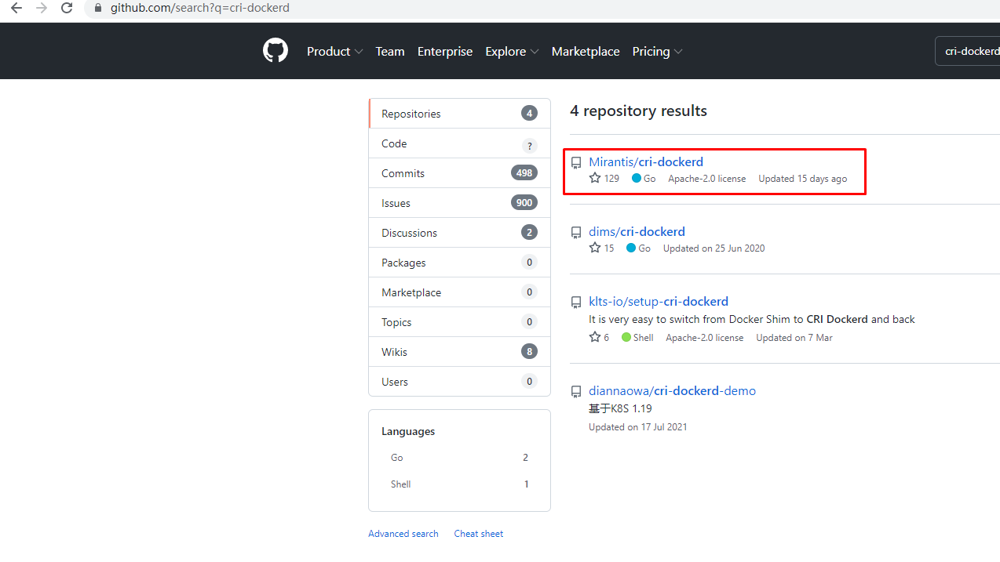


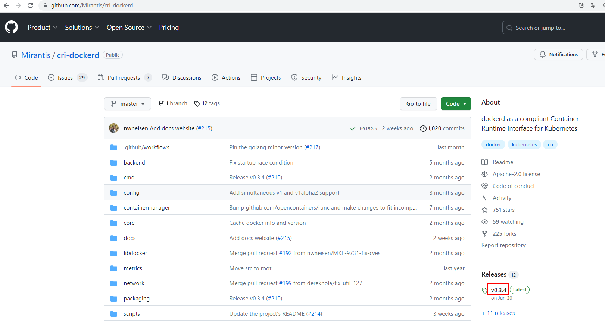


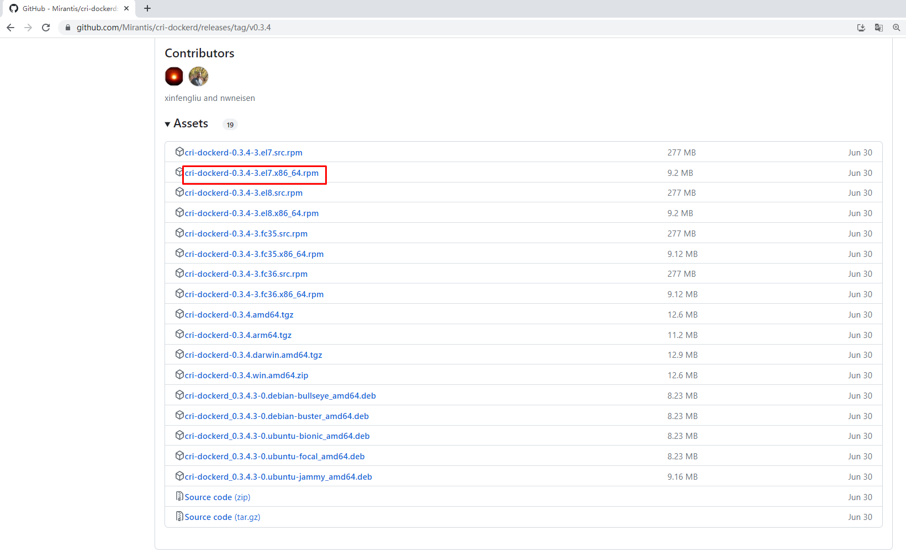


~~~powershell
# wget https://github.com/Mirantis/cri-dockerd/releases/download/v0.3.4/cri-dockerd-0.3.4-3.el7.x86_64.rpm
~~~

~~~powershell
# yum -y install cri-dockerd-0.3.4-3.el7.x86_64.rpm		# 安装完成后，不要急着启动。
~~~

~~~powershell
# vim /usr/lib/systemd/system/cri-docker.service		# 服务启动文件

修改第10行内容
ExecStart=/usr/bin/cri-dockerd --pod-infra-container-image=registry.k8s.io/pause:3.9 --container-runtime-endpoint fd://
~~~

~~~powershell
# systemctl enable --now  cri-docker
~~~


### 6.8.2 kubelet部署

> 在k8s-master01节点上执行


#### 6.8.2.1 创建kubelet-bootstrap的kubeconfig

~~~powershell
BOOTSTRAP_TOKEN=$(awk -F "," '{print $1}' /etc/kubernetes/token.csv)	# 证书的自动签发

kubectl config set-cluster kubernetes --certificate-authority=ca.pem --embed-certs=true --server=https://192.168.59.100:6443 --kubeconfig=kubelet-bootstrap.kubeconfig

kubectl config set-credentials kubelet-bootstrap --token=${BOOTSTRAP_TOKEN} --kubeconfig=kubelet-bootstrap.kubeconfig

kubectl config set-context default --cluster=kubernetes --user=kubelet-bootstrap --kubeconfig=kubelet-bootstrap.kubeconfig

kubectl config use-context default --kubeconfig=kubelet-bootstrap.kubeconfig
~~~


~~~powershell
[root@k8s-master01 k8s-work]# ls
kubelet-bootstrap.kubeconfig 
~~~


~~~powershell
kubectl create clusterrolebinding cluster-system-anonymous --clusterrole=cluster-admin --user=kubelet-bootstrap

kubectl create clusterrolebinding kubelet-bootstrap --clusterrole=system:node-bootstrapper --user=kubelet-bootstrap --kubeconfig=kubelet-bootstrap.kubeconfig
~~~


~~~powershell
kubectl describe clusterrolebinding cluster-system-anonymous	# 角色绑定查看

kubectl describe clusterrolebinding kubelet-bootstrap
~~~


#### 6.8.2.2 创建 kubelet 配置文件，在工作节点创建。


**k8s-worker01**


~~~powershell
mkdir -p  /etc/kubernetes/ssl
~~~


~~~powershell
cat >  /etc/kubernetes/kubelet.json << "EOF"
{
  "kind": "KubeletConfiguration",
  "apiVersion": "kubelet.config.k8s.io/v1beta1",
  "authentication": {
    "x509": {
      "clientCAFile": "/etc/kubernetes/ssl/ca.pem"
    },
    "webhook": {
      "enabled": true,
      "cacheTTL": "2m0s"
    },
    "anonymous": {
      "enabled": false
    }
  },
  "authorization": {
    "mode": "Webhook",
    "webhook": {
      "cacheAuthorizedTTL": "5m0s",
      "cacheUnauthorizedTTL": "30s"
    }
  },
  "address": "192.168.59.173",
  "port": 10250,
  "readOnlyPort": 10255,
  "cgroupDriver": "systemd",                    
  "hairpinMode": "promiscuous-bridge",
  "serializeImagePulls": false,
  "clusterDomain": "cluster.local.",
  "clusterDNS": ["10.96.0.2"]
}
EOF
~~~


**kube-worker02**


~~~powershell
mkdir -p  /etc/kubernetes/ssl
~~~


~~~powershell
cat > /etc/kubernetes/kubelet.json << "EOF"
{
  "kind": "KubeletConfiguration",
  "apiVersion": "kubelet.config.k8s.io/v1beta1",
  "authentication": {
    "x509": {
      "clientCAFile": "/etc/kubernetes/ssl/ca.pem"
    },
    "webhook": {
      "enabled": true,
      "cacheTTL": "2m0s"
    },
    "anonymous": {
      "enabled": false
    }
  },
  "authorization": {
    "mode": "Webhook",
    "webhook": {
      "cacheAuthorizedTTL": "5m0s",
      "cacheUnauthorizedTTL": "30s"
    }
  },
  "address": "192.168.59.174",
  "port": 10250,
  "readOnlyPort": 10255,
  "cgroupDriver": "systemd",                    
  "hairpinMode": "promiscuous-bridge",
  "serializeImagePulls": false,
  "clusterDomain": "cluster.local.",
  "clusterDNS": ["10.96.0.2"]
}
EOF
~~~


#### 6.8.2.3 创建kubelet服务配置文件，服务启动文件。

> 所有worker节点都要执行

~~~powershell
cat > /usr/lib/systemd/system/kubelet.service << "EOF"
[Unit]
Description=Kubernetes Kubelet
Documentation=https://github.com/kubernetes/kubernetes
After=docker.service
Requires=docker.service

[Service]
WorkingDirectory=/var/lib/kubelet
ExecStart=/usr/local/bin/kubelet \
  --bootstrap-kubeconfig=/etc/kubernetes/kubelet-bootstrap.kubeconfig \
  --cert-dir=/etc/kubernetes/ssl \
  --kubeconfig=/etc/kubernetes/kubelet.kubeconfig \
  --config=/etc/kubernetes/kubelet.json \
  --rotate-certificates \
  --container-runtime-endpoint=unix:///run/cri-dockerd.sock \
  --pod-infra-container-image=registry.k8s.io/pause:3.9 \
  --v=2
Restart=on-failure
RestartSec=5

[Install]
WantedBy=multi-user.target
EOF
~~~


~~~powershell
关于容器运行时的说明：
如果使用的是containerd，则--container-runtime-endpoint设置为：unix:///run/containerd/containerd.sock  # 注意这里

# journalctl -u kubelet --no-pager
# journalctl -xefu kubelet
~~~


#### 6.8.2.4 分布CA证书及kubelet-bootstrap.kubeconfig文件


~~~powershell
[root@k8s-master01 k8s-work]# for i in k8s-worker01 k8s-worker02;do scp kubelet-bootstrap.kubeconfig $i:/etc/kubernetes;done

本机执行
# for i in k8sw1 k8sw2;do scp kubelet-bootstrap.kubeconfig $i:/etc/kubernetes;done

~~~


~~~powershell
[root@k8s-master01 k8s-work]# for i in k8s-worker01 k8s-worker02;do scp ca.pem $i:/etc/kubernetes/ssl;done

本机执行
# for i in k8sw1 k8sw2;do scp ca.pem $i:/etc/kubernetes/ssl;done
~~~


#### 6.8.2.5 创建目录及启动kubelet服务


~~~powershell
mkdir -p /var/lib/kubelet	# 在工作节点上创建
~~~


~~~powershell
systemctl daemon-reload
systemctl enable --now kubelet

systemctl status kubelet
~~~


~~~powershell
[root@k8s-master01 bin]# kubectl get nodes
NAME           STATUS     ROLES    AGE     VERSION
k8s-worker01   NotReady   <none>   2m35s   v1.28.0
k8s-worker02   NotReady   <none>   2m9s    v1.28.0
~~~


~~~powershell
[root@k8s-master01 bin]# kubectl get csr
NAME        AGE     SIGNERNAME                                    REQUESTOR           REQUESTEDDURATION   CONDITION
csr-2qknk   5m50s   kubernetes.io/kube-apiserver-client-kubelet   kubelet-bootstrap   <none>              Approved,Issued
csr-2qsb5   8m17s   kubernetes.io/kube-apiserver-client-kubelet   kubelet-bootstrap   <none>              Approved,Issued
csr-4z8hh   9m20s   kubernetes.io/kube-apiserver-client-kubelet   kubelet-bootstrap   <none>              Approved,Issued
csr-9fm5t   10m     kubernetes.io/kube-apiserver-client-kubelet   kubelet-bootstrap   <none>              Approved,Issued
csr-b87xf   3m29s   kubernetes.io/kube-apiserver-client-kubelet   kubelet-bootstrap   <none>              Approved,Issued
csr-d72wv   7m14s   kubernetes.io/kube-apiserver-client-kubelet   kubelet-bootstrap   <none>              Approved,Issued
csr-szg59   3m55s   kubernetes.io/kube-apiserver-client-kubelet   kubelet-bootstrap   <none>              Approved,Issued
~~~


~~~powershell
说明：
确认kubelet服务启动成功后，接着到master上Approve一下bootstrap请求。
~~~

~~~powershell
# kubectl describe node | grep Runtime
  Container Runtime Version:  docker://24.0.5
  Container Runtime Version:  docker://24.0.5
~~~


### 6.8.3 kube-proxy部署，实现容器相关的网络。

#### 6.8.3.1 创建kube-proxy证书请求文件

在 master 节点上执行

~~~powershell
cat > kube-proxy-csr.json << "EOF"
{
  "CN": "system:kube-proxy",
  "key": {
    "algo": "rsa",
    "size": 2048
  },
  "names": [
    {
      "C": "CN",
      "ST": "Shanghai",
      "L": "Shanghai",
      "O": "kubescm",
      "OU": "CN"
    }
  ]
}
EOF
~~~


~~~powershell
[root@k8s-master01 k8s-work]# ls
kube-proxy-csr.json
~~~


#### 6.8.3.2 生成kube-proxy证书


~~~powershell
cfssl gencert -ca=ca.pem -ca-key=ca-key.pem -config=ca-config.json -profile=kubernetes kube-proxy-csr.json | cfssljson -bare kube-proxy
~~~


~~~powershell
输出内容：
2023/08/24 20:15:05 [INFO] generate received request
2023/08/24 20:15:05 [INFO] received CSR
2023/08/24 20:15:05 [INFO] generating key: rsa-2048
2023/08/24 20:15:05 [INFO] encoded CSR
2023/08/24 20:15:05 [INFO] signed certificate with serial number 78998972371002814884851417683033773921348043610
2023/08/24 20:15:05 [WARNING] This certificate lacks a "hosts" field. This makes it unsuitable for
websites. For more information see the Baseline Requirements for the Issuance and Management
of Publicly-Trusted Certificates, v.1.1.6, from the CA/Browser Forum (https://cabforum.org);
specifically, section 10.2.3 ("Information Requirements").

~~~


~~~powershell
[root@k8s-master01 k8s-work]# ls kube-proxy*
kube-proxy.csr
kube-proxy-csr.json
kube-proxy-key.pem
kube-proxy.pem
~~~


#### 6.8.3.3 生成kube-proxy的kubeconfig文件

在 master 节点上执行

~~~powershell
kubectl config set-cluster kubernetes --certificate-authority=ca.pem --embed-certs=true --server=https://192.168.59.100:6443 --kubeconfig=kube-proxy.kubeconfig

kubectl config set-credentials kube-proxy --client-certificate=kube-proxy.pem --client-key=kube-proxy-key.pem --embed-certs=true --kubeconfig=kube-proxy.kubeconfig

kubectl config set-context default --cluster=kubernetes --user=kube-proxy --kubeconfig=kube-proxy.kubeconfig

kubectl config use-context default --kubeconfig=kube-proxy.kubeconfig
~~~


~~~powershell
[root@k8s-master01 k8s-work]# ls kube-proxy.kube*
kube-proxy.kubeconfig
~~~


#### 6.8.3.4 创建kube-proxy服务配置文件


**k8s-worker01**  当前节点 IP

~~~powershell
cat > /etc/kubernetes/kube-proxy.yaml << "EOF"
apiVersion: kubeproxy.config.k8s.io/v1alpha1
bindAddress: 192.168.59.173
clientConnection:
  kubeconfig: /etc/kubernetes/kube-proxy.kubeconfig
clusterCIDR: 10.244.0.0/16
healthzBindAddress: 192.168.59.173:10256
kind: KubeProxyConfiguration
metricsBindAddress: 192.168.59.173:10249
mode: "ipvs"
EOF
~~~


**k8s-worker02**

~~~powershell
cat > /etc/kubernetes/kube-proxy.yaml << "EOF"
apiVersion: kubeproxy.config.k8s.io/v1alpha1
bindAddress: 192.168.59.174
clientConnection:
  kubeconfig: /etc/kubernetes/kube-proxy.kubeconfig
clusterCIDR: 10.244.0.0/16
healthzBindAddress: 192.168.59.174:10256
kind: KubeProxyConfiguration
metricsBindAddress: 192.168.59.174:10249
mode: "ipvs"
EOF
~~~


#### 6.8.3.5 创建kube-proxy服务启动配置文件

> 所有worker节点都需要执行。

~~~powershell
cat >  /usr/lib/systemd/system/kube-proxy.service << "EOF"
[Unit]
Description=Kubernetes Kube-Proxy Server
Documentation=https://github.com/kubernetes/kubernetes
After=network.target

[Service]
WorkingDirectory=/var/lib/kube-proxy
ExecStart=/usr/local/bin/kube-proxy \
  --config=/etc/kubernetes/kube-proxy.yaml \
  --v=2
Restart=on-failure
RestartSec=5
LimitNOFILE=65536

[Install]
WantedBy=multi-user.target
EOF
~~~


#### 6.8.3.6 同步kube-proxy文件到worker节点


~~~powershell
[root@k8s-master01 k8s-work]# for i in k8s-worker01 k8s-worker02;do scp kube-proxy*.pem $i:/etc/kubernetes/ssl/; done

本机执行
# for i in k8sw1 k8sw2;do scp kube-proxy*.pem $i:/etc/kubernetes/ssl;done
~~~

~~~powershell
[root@k8s-master01 k8s-work]# for i in k8s-worker01 k8s-worker02;do scp kube-proxy.kubeconfig $i:/etc/kubernetes/; done

本机执行
# for i in k8sw1 k8sw2;do scp kube-proxy.kubeconfig $i:/etc/kubernetes;done
~~~


#### 6.8.3.7 kube-proxy服务启动


~~~powershell
mkdir -p /var/lib/kube-proxy
systemctl daemon-reload
systemctl enable --now kube-proxy

systemctl status kube-proxy
~~~


# 七、K8S集群网络插件 Calico部署


> 使用calico部署集群网络
>
> 安装参考网址：https://projectcalico.docs.tigera.io/about/about-calico


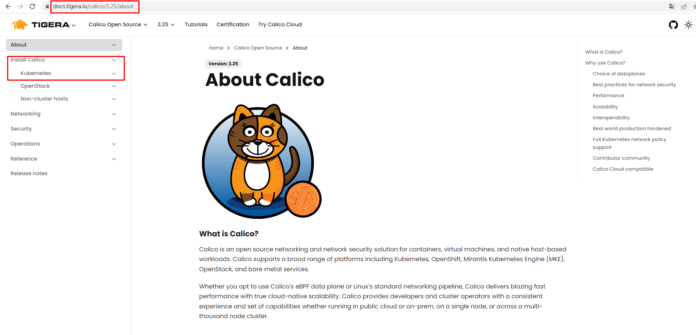


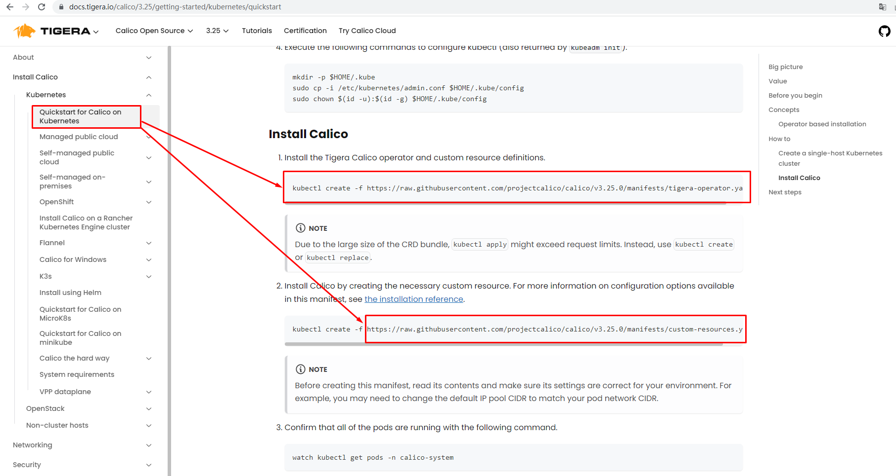


~~~powershell
应用operator资源清单文件
[root@k8s-master01 ~]# kubectl create -f https://raw.githubusercontent.com/projectcalico/calico/v3.26.1/manifests/tigera-operator.yaml

# kubectl get ns	# 查看命名空间
# kubectl get pods -n tigera-operator -o wide	# 查看 pods 运行状态
# kubectl describe pod tigera-operator-94d7f7696-jzfh8 -n tigera-operator	# 查看pod日志

# docker pull quay.io/tigera/operator:v1.30.4	# 手动执行下载安装

# docker pull registry.aliyuncs.com/google_containers/pause:3.9	# 换用阿里云的镜像，手动下载。

# docker images
REPOSITORY                                      TAG       IMAGE ID       CREATED         SIZE
quay.io/tigera/operator                         v1.30.4   261e6f4fa921   3 months ago    68.4MB
registry.aliyuncs.com/google_containers/pause   3.9       e6f181688397   11 months ago   744kB
#
# docker tag registry.aliyuncs.com/google_containers/pause:3.9 registry.k8s.io/pause:3.9	# 重新打tag
#
~~~


~~~powershell
通过自定义资源方式安装
[root@k8s-master01 ~]# wget https://raw.githubusercontent.com/projectcalico/calico/v3.26.1/manifests/custom-resources.yaml		# 资源定义
~~~


~~~powershell
修改文件第13行，修改为使用kubeadm init ----pod-network-cidr对应的IP地址段
[root@k8s-master01 ~]# vim custom-resources.yaml
......
 11     ipPools:
 12     - blockSize: 26
 13       cidr: 10.244.0.0/16 
 14       encapsulation: VXLANCrossSubnet
......

rook-operator rook-ceph 两个工具的部署
~~~


~~~powershell
应用资源清单文件
[root@k8s-master01 ~]# kubectl create -f custom-resources.yaml
~~~


~~~powershell
监视calico-sysem命名空间中pod运行情况
[root@k8s-master01 ~]# watch kubectl get pods -n calico-system

# watch kubectl get pods -n calico-system
~~~

>Wait until each pod has the `STATUS` of `Running`.


# 八、coredns部署，DNS 服务的发现。

> 在k8s-master01节点上执行。

~~~powershell
cat >  coredns.yaml << "EOF"
apiVersion: v1
kind: ServiceAccount
metadata:
  name: coredns
  namespace: kube-system
---
apiVersion: rbac.authorization.k8s.io/v1
kind: ClusterRole
metadata:
  labels:
    kubernetes.io/bootstrapping: rbac-defaults
  name: system:coredns
rules:
  - apiGroups:
    - ""
    resources:
    - endpoints
    - services
    - pods
    - namespaces
    verbs:
    - list
    - watch
  - apiGroups:
    - discovery.k8s.io
    resources:
    - endpointslices
    verbs:
    - list
    - watch
---
apiVersion: rbac.authorization.k8s.io/v1
kind: ClusterRoleBinding
metadata:
  annotations:
    rbac.authorization.kubernetes.io/autoupdate: "true"
  labels:
    kubernetes.io/bootstrapping: rbac-defaults
  name: system:coredns
roleRef:
  apiGroup: rbac.authorization.k8s.io
  kind: ClusterRole
  name: system:coredns
subjects:
- kind: ServiceAccount
  name: coredns
  namespace: kube-system
---
apiVersion: v1
kind: ConfigMap
metadata:
  name: coredns
  namespace: kube-system
data:
  Corefile: |
    .:53 {
        errors
        health {
          lameduck 5s
        }
        ready
        kubernetes cluster.local  in-addr.arpa ip6.arpa {
          fallthrough in-addr.arpa ip6.arpa
        }
        prometheus :9153
        forward . /etc/resolv.conf {
          max_concurrent 1000
        }
        cache 30
        loop
        reload
        loadbalance
    }
---
apiVersion: apps/v1
kind: Deployment
metadata:
  name: coredns
  namespace: kube-system
  labels:
    k8s-app: kube-dns
    kubernetes.io/name: "CoreDNS"
spec:
  # replicas: not specified here:
  # 1. Default is 1.
  # 2. Will be tuned in real time if DNS horizontal auto-scaling is turned on.
  strategy:
    type: RollingUpdate
    rollingUpdate:
      maxUnavailable: 1
  selector:
    matchLabels:
      k8s-app: kube-dns
  template:
    metadata:
      labels:
        k8s-app: kube-dns
    spec:
      priorityClassName: system-cluster-critical
      serviceAccountName: coredns
      tolerations:
        - key: "CriticalAddonsOnly"
          operator: "Exists"
      nodeSelector:
        kubernetes.io/os: linux
      affinity:
         podAntiAffinity:
           preferredDuringSchedulingIgnoredDuringExecution:
           - weight: 100
             podAffinityTerm:
               labelSelector:
                 matchExpressions:
                   - key: k8s-app
                     operator: In
                     values: ["kube-dns"]
               topologyKey: kubernetes.io/hostname
      containers:
      - name: coredns
        image: coredns/coredns:1.10.1
        imagePullPolicy: IfNotPresent
        resources:
          limits:
            memory: 170Mi
          requests:
            cpu: 100m
            memory: 70Mi
        args: [ "-conf", "/etc/coredns/Corefile" ]
        volumeMounts:
        - name: config-volume
          mountPath: /etc/coredns
          readOnly: true
        ports:
        - containerPort: 53
          name: dns
          protocol: UDP
        - containerPort: 53
          name: dns-tcp
          protocol: TCP
        - containerPort: 9153
          name: metrics
          protocol: TCP
        securityContext:
          allowPrivilegeEscalation: false
          capabilities:
            add:
            - NET_BIND_SERVICE
            drop:
            - all
          readOnlyRootFilesystem: true
        livenessProbe:
          httpGet:
            path: /health
            port: 8080
            scheme: HTTP
          initialDelaySeconds: 60
          timeoutSeconds: 5
          successThreshold: 1
          failureThreshold: 5
        readinessProbe:
          httpGet:
            path: /ready
            port: 8181
            scheme: HTTP
      dnsPolicy: Default
      volumes:
        - name: config-volume
          configMap:
            name: coredns
            items:
            - key: Corefile
              path: Corefile
---
apiVersion: v1
kind: Service
metadata:
  name: kube-dns
  namespace: kube-system
  annotations:
    prometheus.io/port: "9153"
    prometheus.io/scrape: "true"
  labels:
    k8s-app: kube-dns
    kubernetes.io/cluster-service: "true"
    kubernetes.io/name: "CoreDNS"
spec:
  selector:
    k8s-app: kube-dns
  clusterIP: 10.96.0.2
  ports:
  - name: dns
    port: 53
    protocol: UDP
  - name: dns-tcp
    port: 53
    protocol: TCP
  - name: metrics
    port: 9153
    protocol: TCP
 
EOF
~~~


~~~powershell
[root@k8s-master01 k8s-work]# kubectl apply -f coredns.yaml
~~~


~~~powershell
[root@k8s-master01 k8s-work]# kubectl get pods -n kube-system
NAME                       READY   STATUS    RESTARTS   AGE
coredns-758895f87b-qplz7   1/1     Running   0          78s

# kubectl get service -n kube-system
NAME              TYPE        CLUSTER-IP   EXTERNAL-IP   PORT(S)         AGE
coredns-coredns   ClusterIP   10.96.0.10   <none>        53/UDP,53/TCP   3h57m
#

# kubectl get pods -n kube-system -o wide	# 查看在那个节点运行
NAME                               READY   STATUS    RESTARTS   AGE    IP               NODE         NOMINATED NODE   READINESS GATES
coredns-coredns-6c9554fc94-lh46v   1/1     Running   0          4h1m   10.244.230.195   k8sworker1   <none>           <none>


# kubectl get service -n kube-system -o wide
NAME              TYPE        CLUSTER-IP   EXTERNAL-IP   PORT(S)         AGE     SELECTOR
coredns-coredns   ClusterIP   10.96.0.10   <none>        53/UDP,53/TCP   3h59m   app.kubernetes.io/instance=coredns,app.kubernetes.io/name=coredns,k8s-app=coredns

~~~


~~~powershell
[root@k8s-worker01 ~]# dig -t a www.baidu.com @10.96.0.2	# 在工作节点进行验证

; <<>> DiG 9.11.4-P2-RedHat-9.11.4-26.P2.el7_9.9 <<>> -t a www.baidu.com @10.96.0.2
;; global options: +cmd
;; Got answer:
;; ->>HEADER<<- opcode: QUERY, status: NOERROR, id: 47201
;; flags: qr rd ra; QUERY: 1, ANSWER: 3, AUTHORITY: 0, ADDITIONAL: 1

;; OPT PSEUDOSECTION:
; EDNS: version: 0, flags:; udp: 4096
;; QUESTION SECTION:
;www.baidu.com.                 IN      A

;; ANSWER SECTION:
www.baidu.com.          30      IN      CNAME   www.a.shifen.com.
www.a.shifen.com.       30      IN      A       39.156.66.18
www.a.shifen.com.       30      IN      A       39.156.66.14

;; Query time: 309 msec
;; SERVER: 10.96.0.2#53(10.96.0.2)
;; WHEN: 四 8月 24 20:53:20 CST 2023
;; MSG SIZE  rcvd: 149


########################################################################################################
在工作节点进行验证，注意 CLUSTER-IP 
# dig -t a www.baidu.com @10.96.0.10

; <<>> DiG 9.9.4-RedHat-9.9.4-61.el7 <<>> -t a www.baidu.com @10.96.0.10
;; global options: +cmd
;; Got answer:
;; ->>HEADER<<- opcode: QUERY, status: NOERROR, id: 41263
;; flags: qr rd ra; QUERY: 1, ANSWER: 3, AUTHORITY: 0, ADDITIONAL: 1

;; OPT PSEUDOSECTION:
; EDNS: version: 0, flags:; udp: 4096
;; QUESTION SECTION:
;www.baidu.com.                 IN      A

;; ANSWER SECTION:
www.baidu.com.          30      IN      CNAME   www.a.shifen.com.
www.a.shifen.com.       30      IN      A       157.0.148.1
www.a.shifen.com.       30      IN      A       157.0.148.128

;; Query time: 204 msec
;; SERVER: 10.96.0.10#53(10.96.0.10)
;; WHEN: Sat Sep 30 01:46:20 CST 2023
;; MSG SIZE  rcvd: 149


~~~


# 九、K8S集群可用性验证，通过两种方式进行验证。

1、通过指令方式查看组件或者资源的状态，是否运行正常，是不是期望的状态。

2、部署应用，应用能正常访问。


~~~powershell
cat >  nginx.yaml  << "EOF"
---
apiVersion: v1
kind: Deployment
metadata:
  name: nginx-web
spec:
  replicas: 2
  selector:
    matchLabels:
      name: nginx
  template:
    metadata:
      labels:
        name: nginx
    spec:
      containers:
        - name: nginx
          image: nginx:1.20.1
          ports:
            - containerPort: 80
---
apiVersion: v1
kind: Service
metadata:
  name: nginx-service-nodeport
spec:
  ports:
    - port: 80
      targetPort: 80
      nodePort: 30001
      protocol: TCP
  type: NodePort
  selector:
    name: nginx
EOF
~~~


```powershell
# kubectl get cs	# 查看组件状态，组件都是健康状态。
Warning: v1 ComponentStatus is deprecated in v1.19+
NAME                 STATUS    MESSAGE   ERROR
controller-manager   Healthy   ok
scheduler            Healthy   ok
etcd-0               Healthy   ok
#

# kubectl cluster-info		# 查看集群控制平面的接口
Kubernetes control plane is running at https://192.168.59.100:6443
CoreDNS is running at https://192.168.59.100:6443/api/v1/namespaces/kube-system/services/coredns-coredns:udp-53/proxy

To further debug and diagnose cluster problems, use 'kubectl cluster-info dump'.
#

# kubectl get nodes		# 查看资源情况
NAME         STATUS   ROLES    AGE     VERSION
k8sworker1   Ready    <none>   5h21m   v1.28.0
k8sworker2   Ready    <none>   5h21m   v1.28.0
#

# kubectl get pods -n kube-system	# 查看命名空间下 pods 是否正常运行
NAME                               READY   STATUS    RESTARTS   AGE
coredns-coredns-6c9554fc94-lh46v   1/1     Running   0          4h20m
#
```


~~~powershell
[root@k8s-master01 k8s-work]# kubectl apply -f nginx.yaml
~~~


~~~powershell
# kubectl get pods
NAME              READY   STATUS    RESTARTS   AGE
nginx-web-5dmq8   1/1     Running   0          4h19m
nginx-web-p2mp6   1/1     Running   0          4h19m
#

[root@k8s-master01 k8s-work]# kubectl get pods -o wide
NAME              READY   STATUS    RESTARTS   AGE   IP              NODE           NOMINATED NODE   READINESS GATES
nginx-web-k6qdb   1/1     Running   0          37s   10.244.69.196   k8s-worker02   <none>           <none>
nginx-web-qmxgz   1/1     Running   0          37s   10.244.79.68    k8s-worker01   <none>           <none>
~~~


~~~powershell
[root@k8s-master01 k8s-work]# kubectl get svc
NAME                     TYPE        CLUSTER-IP      EXTERNAL-IP   PORT(S)        AGE
kubernetes               ClusterIP   10.96.0.1       <none>        443/TCP        6h18m
nginx-service-nodeport   NodePort    10.96.125.147   <none>        80:30001/TCP   64s
~~~


~~~powershell
在工作节点进行验证访问
[root@k8s-worker01 ~]# curl http://10.244.69.196
<!DOCTYPE html>
<html>
<head>
<title>Welcome to nginx!</title>
<style>
    body {
        width: 35em;
        margin: 0 auto;
        font-family: Tahoma, Verdana, Arial, sans-serif;
    }
</style>
</head>
<body>
<h1>Welcome to nginx!</h1>
<p>If you see this page, the nginx web server is successfully installed and
working. Further configuration is required.</p>

<p>For online documentation and support please refer to
<a href="http://nginx.org/">nginx.org</a>.<br/>
Commercial support is available at
<a href="http://nginx.com/">nginx.com</a>.</p>

<p><em>Thank you for using nginx.</em></p>
</body>
</html>
[root@k8s-worker01 ~]# curl http://10.244.79.68
<!DOCTYPE html>
<html>
<head>
<title>Welcome to nginx!</title>
<style>
    body {
        width: 35em;
        margin: 0 auto;
        font-family: Tahoma, Verdana, Arial, sans-serif;
    }
</style>
</head>
<body>
<h1>Welcome to nginx!</h1>
<p>If you see this page, the nginx web server is successfully installed and
working. Further configuration is required.</p>

<p>For online documentation and support please refer to
<a href="http://nginx.org/">nginx.org</a>.<br/>
Commercial support is available at
<a href="http://nginx.com/">nginx.com</a>.</p>

<p><em>Thank you for using nginx.</em></p>
</body>
</html>
[root@k8s-worker01 ~]# curl http://10.96.125.147
<!DOCTYPE html>
<html>
<head>
<title>Welcome to nginx!</title>
<style>
    body {
        width: 35em;
        margin: 0 auto;
        font-family: Tahoma, Verdana, Arial, sans-serif;
    }
</style>
</head>
<body>
<h1>Welcome to nginx!</h1>
<p>If you see this page, the nginx web server is successfully installed and
working. Further configuration is required.</p>

<p>For online documentation and support please refer to
<a href="http://nginx.org/">nginx.org</a>.<br/>
Commercial support is available at
<a href="http://nginx.com/">nginx.com</a>.</p>

<p><em>Thank you for using nginx.</em></p>
</body>
</html>
~~~

